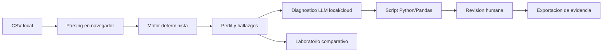

# Estructura propuesta del documento - Segunda entrega

> Fecha de organizacion: 2026-05-19  
> Base documental: `docs/memoria/entregas/primera_entrega/Primera_Entrega_TFM_Joseph_Gari_v2.docx`, `docs/memoria/entregas/primera_entrega/CORRECCION_OE2.md` y `docs/memoria/entregas/segunda_entrega/BORRADOR_SEGUNDA_ENTREGA_CORREGIDA.md`.

## 1. Criterio de entrega semana 10

La segunda entrega debe mostrar que la base teorica y metodologica ya esta cerrada, y que la contribucion tecnica de AURA tiene avances verificables. No debe leerse como una reescritura total de la primera entrega, sino como una version corregida, mas ordenada y respaldada por evidencia tecnica.

La prioridad editorial es:

1. Cerrar el Capitulo 2.
2. Cerrar el Capitulo 3.
3. Reemplazar los placeholders del Capitulo 5 por desarrollo real de AURA.
4. Incluir resultados preliminares defendibles.
5. Refinar introduccion y dejar conclusiones preliminares.

## 2. Estructura recomendada del Word

### Portada, resumen e indices

Mantener la plantilla individual. Antes de entregar, actualizar indice de contenidos, indice de tablas e indice de figuras desde Word.

### Capitulo 1. Introduccion

Estado esperado: refinada.

Contenido recomendado:

- Motivacion del problema de calidad del dato.
- Necesidad de combinar auditoria reproducible, interpretacion asistida y gobernanza humana.
- Presentacion breve de AURA como arquitectura local-first.
- Alcance del trabajo: desarrollo software con evaluacion experimental preliminar.

### Capitulo 2. Contexto y estado del arte

Estado esperado: finalizado.

Secciones sugeridas:

1. Contexto del problema de calidad del dato.
2. Calidad de datos e ISO/IEC 25012.
3. Herramientas rule-based y observabilidad.
4. LLM aplicados a limpieza y diagnostico de datos.
5. Riesgos de alucinacion, privacidad y reproducibilidad.
6. Comparativa de herramientas frente a AURA.
7. Brecha identificada.

Evidencia a insertar:

- Tabla comparativa desde `docs/tablas/tabla_comparativa_herramientas.md`.
- Referencias APA actualizadas.

Mensaje central:

> La brecha no es solo detectar errores, sino integrar evidencia determinista, interpretacion asistida, arquitectura local-first y revision humana en un flujo auditable.

### Capitulo 3. Objetivos concretos y metodologia

Estado esperado: finalizado.

Objetivo general propuesto:

> Desarrollar AURA, una arquitectura local-first para auditoria inteligente de calidad del dato, que combine un motor determinista reproducible con modelos LLM locales o cloud para diagnosticar hallazgos, generar scripts de limpieza auditables y comparar experimentalmente el desempeno de los modelos bajo un flujo human-in-the-loop.

Objetivos especificos reordenados:

| OE | Redaccion recomendada | Evidencia esperada |
|---|---|---|
| OE1 | Desarrollar una arquitectura local-first que permita cargar, procesar y auditar datasets desde el navegador, reduciendo la exposicion de datos sensibles y habilitando componentes locales o cloud. | Flujo de carga local, WebLLM, trazas de ejecucion, diagrama de arquitectura. |
| OE2 | Disenar e implementar un motor de auditoria determinista basado en reglas explicitas, expresiones regulares, heuristica de tipos y estadistica descriptiva, capaz de generar hallazgos reproducibles sobre anomalias estructurales del dataset. | `auditEngine.ts`, catalogo de reglas, perfil del dataset, hallazgos, resultados de validacion. |
| OE3 | Implementar una capa basada en LLM, local o cloud, que reciba hallazgos estructurados del motor determinista, diagnostique causas probables y genere scripts Python/Pandas orientados a corregir o asistir la limpieza del dataset. | Diagnostico generado, paquete estructurado de hallazgos, script, validacion del script, revision humana. |
| OE4 | Implementar un modulo de comparacion experimental integrado al flujo de AURA para evaluar modelos LLM locales y cloud bajo el mismo esquema de entrada, midiendo latencia, formato, alucinaciones, validez de scripts y utilidad para la mejora del dataset. | Laboratorio experimental, benchmark JSON, score compuesto, graficas y tabla de resultados. |

Correccion obligatoria:

- Eliminar la promesa de "precision total nivel 1".
- Reemplazarla por evaluacion experimental con precision, recall, F1, falsos positivos y falsos negativos.

Metodologia:

- CRISP-DM aplicado al ciclo de calidad del dato.
- Scrum aplicado al desarrollo incremental de AURA.
- Arquitectura por capas como estrategia metodologica de control de riesgos.

### Capitulo 4. Marco normativo

Estado esperado: puede mantenerse con ajustes menores.

Usar este capitulo para justificar privacidad, tratamiento local, gobernanza del dato y uso responsable de IA. Evitar repetir el estado del arte.

### Capitulo 5. Desarrollo especifico de la contribucion

Estado esperado: avance significativo y verificable.

Este capitulo es el centro de la segunda entrega. Debe reemplazar los placeholders actuales del Word.

Estructura recomendada:

#### 5.1 Vision general de AURA

Explicar el flujo completo:

1. Carga local del CSV.
2. Perfilamiento del dataset.
3. Motor determinista.
4. Paquete estructurado de hallazgos.
5. Diagnostico con LLM.
6. Generacion de script.
7. Revision humana y simulacion.
8. Exportacion de evidencia.
9. Laboratorio experimental local/cloud.

#### 5.2 Requisitos funcionales y no funcionales

Requisitos funcionales:

- cargar CSV;
- perfilar dataset;
- activar reglas deterministas;
- generar hallazgos reproducibles;
- construir paquete JSON estructurado;
- diagnosticar con LLM;
- generar script Python/Pandas;
- validar script;
- aprobar mediante HITL;
- exportar evidencia;
- comparar modelos.

Requisitos no funcionales:

- local-first;
- trazabilidad;
- reproducibilidad;
- minimizacion de datos;
- separacion entre evidencia e interpretacion;
- control humano antes de acciones destructivas.

#### 5.3 Arquitectura local-first

Relacionar con OE1.

Incluir:

- procesamiento en navegador;
- `csvService.ts`;
- `executionEvidence.ts`;
- WebLLM/WebGPU como opcion local;
- configuracion cloud como modo opcional.

Figura sugerida:

#### 5.4 Motor determinista de auditoria

Relacionar con OE2.

Incluir:

- reglas explicitas;
- expresiones regulares;
- heuristica de tipos;
- estadistica descriptiva;
- `AuditReport`;
- score;
- tabla de hallazgos;
- matriz de reglas activadas.

Evidencia:

- `src/services/auditEngine.ts`;
- `docs/tablas/catalogo_reglas_motor_determinista.md`;
- captura de la etapa "Perfilar";
- `aura_issues_*.csv`;
- `aura_audit_*.json`.

#### 5.5 Diagnostico y generacion de scripts con LLM

Relacionar con OE3.

Punto editorial clave:

> La etapa LLM no reemplaza el perfilamiento. Recibe un paquete estructurado de hallazgos y produce interpretacion, prioridades y scripts asistidos.

Incluir:

- entrada recibida por el LLM;
- advertencia de modo local/cloud;
- diagnostico textual;
- generacion de script;
- validacion automatica;
- revision humana.

Evidencia:

- captura de etapa "Diagnostico";
- captura de etapa "Script";
- captura de etapa "Revision humana";
- script aprobado;
- validacion del script;
- simulacion de mejora.

#### 5.6 Modulo de comparacion experimental

Relacionar con OE4.

Separarlo del flujo principal. Presentarlo como laboratorio experimental que usa el mismo paquete de entrada para comparar modelos.

Metricas:

- latencia;
- primer token;
- tokens generados;
- tokens por segundo;
- cumplimiento JSON;
- columnas alucinadas;
- claims sin soporte;
- script Python incluido;
- validez del script;
- score compuesto.

Evidencia:

- `benchmark-results-*.json`;
- tabla de resultados;
- graficas de score, radar y latencia;
- `experiments/results/benchmark_multimodelo.json` solo como intento fallido si la API key no es valida.

#### 5.7 Exportacion y trazabilidad

Explicar los artefactos exportables:

- reporte PDF;
- JSON de auditoria;
- CSV de issues;
- script aprobado;
- JSON de benchmark;
- JSON de improvement run.

### Resultados preliminares

Estado esperado: boceto con metricas defendibles.

Resultados que ya pueden aparecer:

- motor determinista sobre dataset sintetico:
  - precision: 37.93%;
  - recall: 84.62%;
  - F1: 52.38%;
  - TP: 22;
  - FP: 36;
  - FN: 4.

Interpretacion correcta:

> El motor es reproducible y tiene alta capacidad de deteccion, pero genera ruido. Esto justifica la etapa LLM y la revision humana. No debe presentarse como precision total.

Resultados que deben quedar como pendientes o intentos:

- benchmark Gemini con API key invalida;
- comparativas local/cloud no ejecutadas formalmente;
- resultados sin JSON exportado desde AURA.

### Conclusiones preliminares

Organizar por objetivo:

- OE1: arquitectura local-first implementada en flujo de carga, parsing y auditoria.
- OE2: motor determinista implementado, con evidencia reproducible y metricas preliminares.
- OE3: flujo de diagnostico, script y revision humana integrado.
- OE4: laboratorio experimental disponible, pendiente de corridas formales completas.

## 3. Evidencia minima que debe anexarse

Para que la segunda entrega quede defendible, anexar al documento:

1. Captura de pantalla del flujo inicial de AURA.
2. Captura de la etapa "Perfilar".
3. Captura de la tabla de hallazgos.
4. Captura del paquete estructurado de hallazgos.
5. Captura de la etapa "Diagnostico".
6. Captura del script generado.
7. Captura de revision humana y simulacion.
8. Captura del laboratorio experimental.
9. JSON de auditoria exportado.
10. CSV de issues exportado.
11. Script aprobado exportado.
12. JSON de benchmark si se ejecutan modelos.

## 4. Orden recomendado de trabajo

1. Duplicar el Word de primera entrega como documento de segunda entrega.
2. Actualizar Capitulo 3 con objetivos reordenados y correccion de "precision total".
3. Cerrar Capitulo 2 con tabla comparativa y referencias APA.
4. Reescribir Capitulo 5 usando la arquitectura y evidencias de AURA.
5. Ejecutar AURA con al menos un dataset de prueba.
6. Exportar artefactos desde AURA.
7. Insertar capturas, tablas y resultados preliminares.
8. Revisar formato Word, indices, tablas, figuras y referencias.
