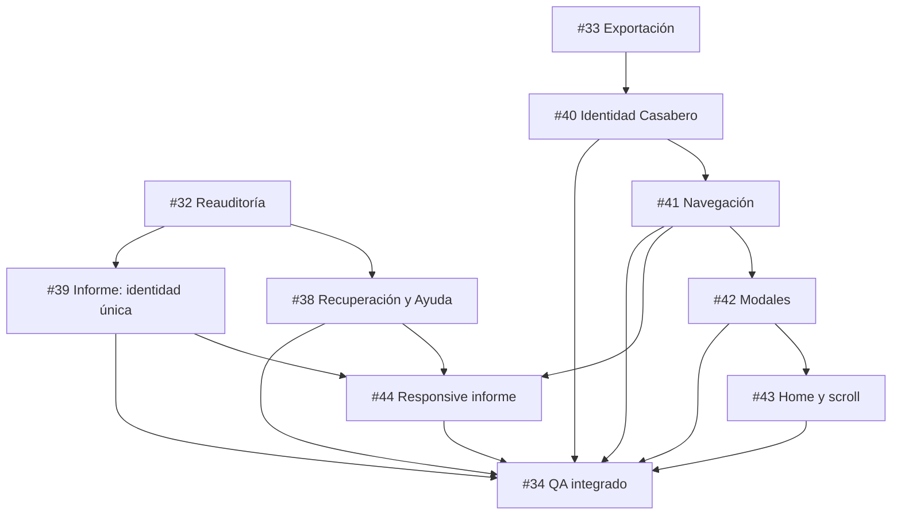

# AURA UX/UI Remediation Implementation Plan
> **For Execution:** Use `executing-plans` or `subagent-driven-development`.

**Goal:** Cerrar con evidencia los nueve hallazgos de la auditoría UX/UI de AURA sin alterar el motor determinista, scoring ni contratos técnicos.

**Architecture:** Siete PR atómicos sobre la capa de presentación, ordenados por dependencias y revisados mediante un issue orquestador. El estándar Casabero gobierna identidad, controles, estados, navegación, modales y responsive; el dominio existente sigue siendo la fuente de verdad para hallazgos, proveedores y exportación.

**Tech Stack:** React 19, TypeScript, CSS, Vitest, Testing Library, Playwright, Graphify y GitHub Issues.

---

## 1. Fuentes y línea base

- Programa: [GitHub #37](https://github.com/casabero-labs/aura/issues/37).
- Auditoría: [`docs/product/aura/auditoria_ux_ui/README.md`](../product/aura/auditoria_ux_ui/README.md).
- Hallazgos: [`04_HALLAZGOS_PRIORIZADOS.md`](../product/aura/auditoria_ux_ui/04_HALLAZGOS_PRIORIZADOS.md).
- Commit auditado: `d9272a264fad2d2a33b9745908231f25c78cf4c9`.
- Auditoría publicada en: `8d69c100f6b26ff77641489bebdb00c44e8e3682`.
- Fuente visual primaria: `/Users/casabero/Documents/GitHub/estandar-casabero/examples/frontend/showcase.html`.
- Estándar accesible: `/Users/casabero/Documents/GitHub/estandar-casabero/standards/frontend/ACCESSIBILITY.md`.
- Tokens y componentes: `/Users/casabero/Documents/GitHub/estandar-casabero/standards/frontend/DESIGN_SYSTEM.md`.
- Contrato AURA: [`DESIGN.md`](../../DESIGN.md).

## 2. Límites no negociables

- No modificar `src/services/auditEngine.ts`, scoring, severidades ni reglas.
- No cambiar contratos LLM, OE4, `calibrationEvidence`, modelos o prompts.
- No cambiar la semántica de JSON, ZIP, PDF, Apply/Verify o reauditoría.
- No introducir una segunda biblioteca visual ni nuevos tokens arbitrarios.
- No trabajar en `main`: un issue, una rama `codex/aura-ux-<slug>`, un PR draft.
- No fusionar ni cerrar desde el agente ejecutor.
- No aceptar una prueba que pasa sin comprobar el estado: nada de `if (count > 0)`, `catch(() => false)` o `waitForTimeout` como readiness.
- Después de cambiar código, ejecutar `graphify update .`.

## 3. Decisiones de producto cerradas

1. El recorrido principal tiene cinco etapas:

   `Carga → Perfil base → Diagnóstico → Reporte diagnóstico → Exportación`.

   Script, revisión, ejecución y reauditoría son una rama opcional.

2. Un proveedor no disponible ofrece dos acciones visibles:

   - `Continuar con informe determinista` → `onContinue` existente.
   - `Cambiar proveedor` → `onOpenSettings` existente.

3. `finding.id` define identidad en el informe. Un hallazgo se renderiza una vez;
   `requiresHumanReview` es atributo, no una segunda entidad.
4. `Trazabilidad` sale del menú móvil global. No se añade al escritorio y no se
   eliminan trazas técnicas contextuales.
5. La marca canónica contiene tres elipses iguales del mismo `currentColor`,
   rotadas `0/+60/-60`, `strokeWidth=1.55`, sin centro, glifo o segundo color.
6. El foco visible prevalece sobre cualquier texto ambiguo del showcase.
7. `AURA-UX-003` solo produce cambio si el E2E lo reproduce establemente.

## 4. Dependencias



Los PR que modifiquen `App.tsx` se fusionan secuencialmente. Antes de iniciar el
siguiente, el agente hace rebase sobre `origin/main` y vuelve a ejecutar la
reproducción focal.

## 5. Contrato de entrega de agentes

Cada respuesta debe contener:

```markdown
## ENTREGA UX/UI
- Issue / PR / rama / base SHA / SHA final
- Hallazgos cubiertos
- Evidencia RED
- Archivos y decisiones
- Referencias exactas del showcase aplicadas
- Pruebas focales y conteo
- Playwright escritorio/móvil
- Accesibilidad, consola y overflow
- Capturas
- Limitaciones
- Estado: COMPLETE | BLOCKED
- Confirmación: no fusionó y no amplió alcance
```

La revisión del orquestador devuelve uno de estos veredictos:

- `APPROVED_FOR_MERGE`: alcance, Red→Green, browser y gates completos.
- `CHANGES_REQUIRED`: lista cerrada de discrepancias con archivo, criterio y prueba.
- `BLOCKED`: dependencia o conflicto externo demostrado.

---

## Task 0 — Congelar base y demostrar que no hay trabajo concurrente

**Issue:** [#37](https://github.com/casabero-labs/aura/issues/37)

**Step 1: Inspeccionar estado**

```bash
git status --short --branch
git fetch origin
git rev-parse HEAD
git rev-parse origin/main
gh pr list --repo casabero-labs/aura --state open
```

**Step 2: Verificar dependencias**

- #38 y #39 esperan integración de #32.
- #40–#43 esperan integración de #33.
- #44 espera #38, #39 y #41.
- #34 es QA integrado; no implementa hallazgos tardíamente.

**Step 3: Abrir rama**

```bash
git switch -c codex/aura-ux-<slug> origin/main
```

**Step 4: Registrar base SHA en el issue antes de editar**

Esperado: rama limpia, sin PR concurrente en los mismos archivos.

---

## Task 1 — Recuperación explícita y Ayuda coherente

**Issue:** [#38](https://github.com/casabero-labs/aura/issues/38)<br>
**Hallazgos:** `AURA-UX-001`, `AURA-CONTENT-001`

**Files:**

- Modify: `src/components/DiagnosisStep.tsx`
- Modify: `src/components/HelpCenter.tsx`
- Create: `src/__tests__/DiagnosisProviderRecovery.test.tsx`
- Create: `src/__tests__/HelpCenter.test.tsx`
- Modify: `src/tests/e2e/aura-provider-readiness.spec.ts`
- Modify, only in existing recovery selectors: `src/index.css`

### Step 1: Write failing component tests

El helper de render debe reutilizar las props mínimas de los tests de Diagnóstico
existentes. Los asserts nuevos son:

```tsx
it('offers a deterministic path and real provider settings', async () => {
  const user = userEvent.setup();
  const onContinue = vi.fn();
  const onOpenSettings = vi.fn();

  renderUnavailableDiagnosis({
    providerType: 'cloud',
    apiKey: '',
    onContinue,
    onOpenSettings,
  });

  expect(screen.getByRole('status')).toHaveTextContent('Proveedor no disponible');
  expect(screen.getByRole('button', { name: 'Generar diagnóstico asistido' })).toBeDisabled();

  await user.click(screen.getByRole('button', { name: 'Continuar con informe determinista' }));
  expect(onContinue).toHaveBeenCalledTimes(1);

  await user.click(screen.getByRole('button', { name: 'Cambiar proveedor' }));
  expect(onOpenSettings).toHaveBeenCalledTimes(1);
});
```

Ayuda:

```tsx
it('finds the exact provider error and describes remediation as optional', async () => {
  const user = userEvent.setup();
  render(<HelpCenter onClose={vi.fn()} />);

  await user.type(screen.getByRole('searchbox'), 'proveedor no disponible');
  expect(screen.getByText(/continuar con informe determinista/i)).toBeVisible();
  expect(screen.getByText(/remediación opcional/i)).toBeVisible();
});
```

### Step 2: Verify RED

```bash
npm --prefix src test -- --run __tests__/DiagnosisProviderRecovery.test.tsx __tests__/HelpCenter.test.tsx
```

Expected: acciones y resultado de búsqueda ausentes.

### Step 3: Implement the minimal recovery contract

Usar los callbacks existentes:

```tsx
<div className="provider-unavailable-notice" role="status" aria-live="polite">
  <div className="provider-unavailable-header">
    <TriangleAlert aria-hidden="true" />
    <strong>Proveedor no disponible</strong>
  </div>
  <p>{providerUnavailableReason}</p>
  <div className="provider-unavailable-actions">
    <button type="button" className="btn-p" onClick={onContinue}>
      Continuar con informe determinista
    </button>
    <button type="button" className="btn-s" onClick={onOpenSettings}>
      Cambiar proveedor
    </button>
  </div>
</div>
```

No generar una ejecución LLM ni alterar `providerAvailable` al continuar.

### Step 4: Implement Help from the real five-step contract

La sección debe contener la misma frase del error y separar visualmente:

```text
Carga → Perfil base → Diagnóstico → Reporte diagnóstico → Exportación
                                  └─ Remediación opcional
```

### Step 5: Verify GREEN and human journey

```bash
npm --prefix src test -- --run __tests__/DiagnosisProviderRecovery.test.tsx __tests__/HelpCenter.test.tsx
npm --prefix src run test:e2e -- tests/e2e/aura-provider-readiness.spec.ts
```

Playwright debe completar el camino sin clicar el stepper, a `1440×900` y
`390×844`, con ambas acciones visibles y sin overflow.

### Step 6: Gates and commit

```bash
npm --prefix src run typecheck
npm --prefix src run build
graphify update .
git diff --check
git commit -m "fix(ux): make diagnosis recovery explicit"
```

---

## Task 2 — Una entidad principal por hallazgo

**Issue:** [#39](https://github.com/casabero-labs/aura/issues/39)<br>
**Hallazgo:** `AURA-UX-002`

**Files:**

- Modify: `src/components/DiagnosticReportStep.tsx`
- Modify if attribute presentation needs it: `src/components/diagnosticReport/DiagnosticFindingGroup.tsx`
- Modify: `src/__tests__/diagnosticReportStep.test.tsx`
- Create: `src/tests/e2e/aura-report-findings.spec.ts`

### Step 1: Write the overlap test

```tsx
it('renders one primary entity when groups share a finding id', () => {
  const duplicated = makeFinding({ id: 'duplicate-row', requiresHumanReview: true });
  const report = makeDiagnosticReport({
    confirmedRisks: [duplicated],
    humanReviewRequired: [duplicated],
  });

  renderReport(report);

  expect(screen.getAllByTestId('diagnostic-finding-duplicate-row')).toHaveLength(1);
  expect(screen.getByText(/requiere decisión humana/i)).toBeVisible();
  expect(screen.getByTestId('diagnostic-report-total-findings')).toHaveTextContent('1');
});
```

Agregar 0 hallazgos, un hallazgo, IDs distintos con igual título, exclusivo de
revisión humana e inmutabilidad de entrada.

### Step 2: Verify RED

```bash
npm --prefix src test -- --run __tests__/diagnosticReportStep.test.tsx
```

Expected: el mismo ID produce dos tarjetas.

### Step 3: Implement a presentation-only union

```tsx
type VisibleFinding = DiagnosticFinding & {
  groupMembership: Array<'confirmed' | 'human-review' | 'false-positive'>;
};

function buildVisibleFindings(report: DiagnosticReport): VisibleFinding[] {
  const byId = new Map<string, VisibleFinding>();
  const add = (finding: DiagnosticFinding, membership: VisibleFinding['groupMembership'][number]) => {
    const current = byId.get(finding.id);
    if (current) {
      if (!current.groupMembership.includes(membership)) current.groupMembership.push(membership);
      return;
    }
    byId.set(finding.id, { ...finding, groupMembership: [membership] });
  };

  report.findingGroups.confirmedRisks.forEach((finding) => add(finding, 'confirmed'));
  report.findingGroups.humanReviewRequired.forEach((finding) => add(finding, 'human-review'));
  report.findingGroups.possibleFalsePositiveCandidates.forEach((finding) => add(finding, 'false-positive'));
  return [...byId.values()];
}
```

No mutar `findingGroups`; no modificar builder, tipos públicos ni exportación.

### Step 4: Verify GREEN and E2E

```bash
npm --prefix src test -- --run __tests__/diagnosticReportStep.test.tsx
npm --prefix src run test:e2e -- tests/e2e/aura-report-findings.spec.ts
```

Fixture auditado: `4` en resumen, `4` entidades principales, `Filas Duplicadas`
una vez y su decisión humana todavía visible.

### Step 5: Gates and commit

```bash
npm --prefix src run typecheck
npm --prefix src run build
graphify update .
git diff --check
git commit -m "fix(ux): render report findings once"
```

---

## Task 3 — Fundación visual Casabero

**Issue:** [#40](https://github.com/casabero-labs/aura/issues/40)<br>
**Hallazgo:** `AURA-UI-002`

**Files:**

- Create: `src/components/AuraMark.tsx`
- Modify: `src/App.tsx`
- Modify: `src/index.css`
- Modify: `DESIGN.md`
- Create: `src/__tests__/App.brand.test.tsx`
- Modify: `src/tests/e2e/aura-qa-screenshots.spec.ts`

### Step 1: Write the DOM contract test

```tsx
it('renders only the canonical three-ellipse mark', () => {
  render(<AuraMark title="AURA" />);
  const svg = screen.getByTitle('AURA').closest('svg')!;

  expect(svg.querySelectorAll('ellipse')).toHaveLength(3);
  expect(svg.querySelectorAll('path, rect, circle, polygon, line')).toHaveLength(0);
  expect(svg).toHaveAttribute('stroke', 'currentColor');
  expect(svg).toHaveAttribute('stroke-width', '1.55');
});
```

### Step 2: Verify RED

```bash
npm --prefix src test -- --run __tests__/App.brand.test.tsx
```

Expected: marca tipo tablero con nueve formas.

### Step 3: Implement the exact mark

```tsx
export function AuraMark({ title }: { title?: string }) {
  return (
    <svg viewBox="0 0 64 64" fill="none" stroke="currentColor" strokeWidth="1.55" aria-hidden={title ? undefined : true}>
      {title && <title>{title}</title>}
      <ellipse cx="32" cy="32" rx="24" ry="8.5" />
      <ellipse cx="32" cy="32" rx="24" ry="8.5" transform="rotate(60 32 32)" />
      <ellipse cx="32" cy="32" rx="24" ry="8.5" transform="rotate(-60 32 32)" />
    </svg>
  );
}
```

### Step 4: Align only the audited Home CTA

```css
.home-primary-cta {
  width: fit-content;
  min-width: 120px;
  height: 44px;
  padding: 0 18px;
  color: var(--ink);
  background: transparent;
  border: 1px solid rgba(43, 37, 33, 0.38);
  border-radius: 6px;
}
```

Hover, active, disabled y focus deben reutilizar los estados del showcase. No
restilizar botones destructivos u operativos fuera del hallazgo.

### Step 5: Verify theme and screenshots

```bash
npm --prefix src test -- --run __tests__/App.brand.test.tsx
npm --prefix src run test:e2e -- tests/e2e/aura-qa-screenshots.spec.ts
```

Capturas claro/oscuro a `1440×900` y `390×844`; computed style del CTA; sin
overflow ni errores de consola.

### Step 6: Gates and commit

```bash
npm --prefix src run typecheck
npm --prefix src run build
graphify update .
git diff --check
git commit -m "fix(ui): align AURA identity with Casabero"
```

---

## Task 4 — Navegación global nativa y consistente

**Issue:** [#41](https://github.com/casabero-labs/aura/issues/41)<br>
**Hallazgos:** `AURA-A11Y-001`, `AURA-IA-001`

**Files:**

- Modify: `src/App.tsx`
- Modify: `src/index.css`
- Modify: `src/__tests__/App.navigation.test.tsx`
- Modify: `src/tests/e2e/phase7-nav-smoke.spec.ts`

### Step 1: Write failing semantic tests

```tsx
it('hides closed mobile navigation from the accessibility tree', async () => {
  const user = userEvent.setup();
  render(<App />);

  const toggle = screen.getByRole('button', { name: 'Abrir menú principal' });
  expect(toggle).toHaveAttribute('aria-expanded', 'false');
  expect(screen.queryByRole('navigation', { name: 'Navegación móvil' })).not.toBeInTheDocument();

  await user.click(toggle);
  expect(toggle).toHaveAttribute('aria-expanded', 'true');
  const nav = screen.getByRole('navigation', { name: 'Navegación móvil' });
  expect(within(nav).getAllByRole('button').map((item) => item.textContent)).toEqual([
    'Home', 'Auditoría', 'Laboratorio', 'Configuración',
  ]);
});
```

### Step 2: Verify RED

```bash
npm --prefix src test -- --run __tests__/App.navigation.test.tsx
```

### Step 3: Replace click semantics and closed menu state

```tsx
<button type="button" className="nav-brand" onClick={goHome} aria-label="Ir al inicio">
  <AuraMark />
  <span>AURA</span>
</button>

<button
  type="button"
  className="nav-mobile-toggle"
  aria-label={mobileMenuOpen ? 'Cerrar menú principal' : 'Abrir menú principal'}
  aria-expanded={mobileMenuOpen}
  aria-controls="aura-mobile-navigation"
  onClick={() => setMobileMenuOpen((open) => !open)}
>
  {mobileMenuOpen ? <X aria-hidden="true" /> : <Menu aria-hidden="true" />}
</button>

{mobileMenuOpen && (
  <nav id="aura-mobile-navigation" aria-label="Navegación móvil">{mobileDestinations}</nav>
)}
```

`mobileDestinations` debe derivar del mismo arreglo de Home, Auditoría,
Laboratorio y Configuración usado para escritorio. No incluir `Trazabilidad`.

### Step 4: Verify keyboard and responsive states

```bash
npm --prefix src test -- --run __tests__/App.navigation.test.tsx
npm --prefix src run test:e2e -- tests/e2e/phase7-nav-smoke.spec.ts
```

Probar Tab, Shift+Tab, Enter, Space, Escape, foco visible y árbol accesible a
`1440`, `834`, `640`, `390` y `320px`.

### Step 5: Gates and commit

```bash
npm --prefix src run typecheck
npm --prefix src run build
graphify update .
git diff --check
git commit -m "fix(a11y): make global navigation semantic"
```

---

## Task 5 — Patrón modal compartido

**Issue:** [#42](https://github.com/casabero-labs/aura/issues/42)<br>
**Hallazgo:** `AURA-A11Y-002`

**Files:**

- Create: `src/components/ModalDialog.tsx`
- Create: `src/__tests__/ModalDialog.test.tsx`
- Create: `src/__tests__/ChangelogModal.test.tsx`
- Modify: `src/App.tsx`
- Modify: `src/components/ChangelogModal.tsx`
- Inspect: `src/components/diagnosis/DiagnosisQuickConfigModal.tsx`
- Modify: `src/index.css`
- Modify: `src/tests/e2e/aura-full-flow-export.spec.ts`

### Step 1: Write the behavior contract

```tsx
it('contains focus, closes with Escape and restores the trigger', async () => {
  const user = userEvent.setup();
  render(<DialogHarness />);

  const trigger = screen.getByRole('button', { name: 'Abrir historial' });
  await user.click(trigger);

  const dialog = screen.getByRole('dialog', { name: 'Historial' });
  expect(dialog).toContainElement(document.activeElement);

  await user.keyboard('{Escape}');
  expect(screen.queryByRole('dialog')).not.toBeInTheDocument();
  expect(trigger).toHaveFocus();
});
```

Agregar Tab/Shift+Tab, close button, overlay, fondo no operable y foco inicial
en `Cancelar` para destrucción.

### Step 2: Verify RED

```bash
npm --prefix src test -- --run __tests__/ModalDialog.test.tsx __tests__/ChangelogModal.test.tsx
```

### Step 3: Implement the shared focus lifecycle

El componente debe guardar `document.activeElement`, enfocar un destino seguro,
capturar `Tab` dentro, cerrar con `Escape` y restaurar el foco. Su raíz expone:

```tsx
<div className="modal-overlay" role="presentation">
  <section
    ref={dialogRef}
    className="modal-container"
    role="dialog"
    aria-modal="true"
    aria-labelledby={titleId}
    aria-describedby={descriptionId}
    tabIndex={-1}
  >
    {children}
  </section>
</div>
```

El botón iconográfico usa `aria-label="Cerrar"` y 44×44px en móvil. Historial,
Nuevo análisis y Destruir sesión migran al mismo componente.

### Step 4: Verify three real modal journeys

```bash
npm --prefix src test -- --run __tests__/ModalDialog.test.tsx __tests__/ChangelogModal.test.tsx
npm --prefix src run test:e2e -- tests/e2e/aura-full-flow-export.spec.ts
```

Playwright: Historial, Nuevo análisis y Destruir sesión; foco inicial, ciclo,
Escape, retorno, fondo y móvil.

### Step 5: Gates and commit

```bash
npm --prefix src run typecheck
npm --prefix src run build
graphify update .
git diff --check
git commit -m "fix(a11y): standardize accessible dialogs"
```

---

## Task 6 — Reproducir y corregir el scroll de Home

**Issue:** [#43](https://github.com/casabero-labs/aura/issues/43)<br>
**Hallazgo:** `AURA-UX-003`

**Files:**

- Modify first: `src/tests/e2e/phase7-nav-smoke.spec.ts`
- Modify only if RED is stable: `src/App.tsx`
- Modify as secondary coverage: `src/__tests__/App.navigation.test.tsx`

### Step 1: Write the real reload reproduction

```ts
test('Home starts at the top after a persisted audit session reload', async ({ page }) => {
  await seedPersistedAuditSession(page);
  await page.goto('/');
  await page.getByRole('heading', { name: /audita tus datos/i }).waitFor();

  await expect.poll(() => page.evaluate(() => window.scrollY)).toBe(0);
  await expect(page.getByRole('heading', { level: 1 })).toBeInViewport();
  await expect(page.getByRole('button', { name: 'Empezar auditoría' })).toBeInViewport();
});
```

Ejecutar tres veces a `390×844` y una a `1440×900`.

### Step 2: Decide from evidence

- Si falla establemente: implementar reset al montar/entrar en Home.
- Si no falla: no crear un `scrollTo` global; entregar evidencia y reclasificar
  confianza.

### Step 3: Minimal state-bound reset if necessary

```tsx
const previousSurfaceRef = useRef<'home' | 'workspace'>();

useLayoutEffect(() => {
  const surface = showHome ? 'home' : 'workspace';
  if (surface === 'home' && previousSurfaceRef.current !== 'home') {
    window.scrollTo({ top: 0, left: 0, behavior: 'auto' });
  }
  previousSurfaceRef.current = surface;
}, [showHome]);
```

No depender de estados que cambian mientras la persona permanece en Home.

### Step 4: Verify and commit

```bash
npm --prefix src test -- --run __tests__/App.navigation.test.tsx
npm --prefix src run test:e2e -- tests/e2e/phase7-nav-smoke.spec.ts --repeat-each=3
npm --prefix src run typecheck
npm --prefix src run build
graphify update .
git diff --check
git commit -m "fix(ux): reset Home context on entry"
```

Si no hay reproducción, sustituir el commit por un comentario de evidencia y
solicitar cierre/reclasificación al orquestador.

---

## Task 7 — Informe y stepper legibles hasta 320px

**Issue:** [#44](https://github.com/casabero-labs/aura/issues/44)<br>
**Hallazgo:** `AURA-UI-001`

**Files:**

- Modify: `src/components/DiagnosticReportStep.tsx`
- Modify: `src/components/PipelineProgress.tsx`
- Modify: `src/index.css`
- Modify: `src/__tests__/diagnosticReportStep.test.tsx`
- Create: `src/__tests__/PipelineProgress.test.tsx`
- Create: `src/tests/e2e/aura-report-responsive.spec.ts`

### Step 1: Write semantic unit tests

```tsx
it('marks the active pipeline step', () => {
  render(<PipelineProgress currentStep="diagnostic_report" onStepClick={vi.fn()} />);
  expect(screen.getByRole('button', { name: /reporte diagnóstico/i })).toHaveAttribute('aria-current', 'step');
});
```

El test de informe debe comprobar que desaparece `wordBreak: 'break-all'` y que
el nombre completo sigue disponible mediante texto, `title` o nombre accesible.

### Step 2: Verify RED

```bash
npm --prefix src test -- --run __tests__/diagnosticReportStep.test.tsx __tests__/PipelineProgress.test.tsx
```

### Step 3: Fix metadata wrapping

```css
.diagnostic-report-summary-value--filename {
  min-width: 0;
  overflow-wrap: anywhere;
  word-break: normal;
  hyphens: none;
}

.diagnostic-report-summary-value--date {
  white-space: normal;
  text-wrap: balance;
}
```

No truncar sin conservar el valor completo semánticamente.

### Step 4: Keep the active step visible

```tsx
const activeStepRef = useRef<HTMLButtonElement>(null);

useLayoutEffect(() => {
  activeStepRef.current?.scrollIntoView({
    block: 'nearest',
    inline: 'center',
    behavior: 'auto',
  });
}, [currentStep]);
```

Asignar `ref` solo al paso activo y `aria-current="step"`. Si envolver o
compactar produce mejor resultado, conservar el mismo contrato y documentar la
decisión; el showcase no define estética de stepper móvil.

### Step 5: Browser matrix

```bash
npm --prefix src run test:e2e -- tests/e2e/aura-report-responsive.spec.ts
```

Viewports: `320×720`, `390×844`, `640×800`, `833×900`, `1440×900`; además zoom
200%. En todos: etapa activa visible, filename/fecha legibles, página y
contenedor con `scrollWidth <= clientWidth`, cero consola/error.

### Step 6: Gates and commit

```bash
npm --prefix src test -- --run __tests__/diagnosticReportStep.test.tsx __tests__/PipelineProgress.test.tsx
npm --prefix src run typecheck
npm --prefix src run build
graphify update .
git diff --check
git commit -m "fix(ui): preserve report context on mobile"
```

---

## Task 8 — QA integrado y veredicto

**Issue:** [#34](https://github.com/casabero-labs/aura/issues/34)

No implementar hallazgos en esta fase. Si un criterio falla, devolverlo a su
issue y PR de origen.

### Step 1: Full automated suite

```bash
npm --prefix src test -- --run
npm --prefix src run typecheck
npm --prefix src run build
npm --prefix src run test:e2e -- \
  tests/e2e/aura-provider-readiness.spec.ts \
  tests/e2e/aura-report-findings.spec.ts \
  tests/e2e/aura-report-responsive.spec.ts \
  tests/e2e/phase7-nav-smoke.spec.ts \
  tests/e2e/aura-full-flow-export.spec.ts \
  tests/e2e/aura-qa-screenshots.spec.ts
git diff --check
git status --short
```

### Step 2: Human-first matrix

Validar `1440×900`, `1024×768`, `390×844` y `320×720`:

1. Home explica propósito y CTA.
2. Marca y CTA coinciden con showcase.
3. Menú cerrado/abierto y teclado.
4. Archivo inválido y recuperación.
5. Fixture válido → Perfil.
6. Proveedor no disponible → informe mediante CTA textual.
7. Cuatro hallazgos únicos y decisiones comprensibles.
8. Metadata/stepper responsivos.
9. Historial y destrucción con foco modal.
10. Exportación sigue disponible.
11. Sin overflow, `pageerror`, `console.error` ni warning nuevo.

### Step 3: Accessibility evidence

- Teclado completo, foco visible, Escape y retorno.
- Árbol accesible con menú cerrado/abierto.
- Axe: cero Critical/Serious atribuibles al alcance.
- Lighthouse Accessibility desktop/móvil ≥ 90.
- Un lector de pantalla nativo; si no está disponible, declarar `NOT_AVAILABLE`
  y no inventar PASS.

### Step 4: Closeout

Crear `docs/product/aura/UX_UI_REMEDIATION_CLOSEOUT.md` con:

- base/final SHA;
- tabla `hallazgo → issue → PR → evidencia → estado`;
- referencias Casabero aplicadas;
- comandos y conteos;
- capturas;
- limitaciones reales;
- veredicto `GO | NO-GO`.

La auditoría original permanece como línea base histórica; no reescribirla como
si nunca hubieran existido los hallazgos.

## 6. Criterio final del programa

`GO` solo cuando:

- los cuatro P1 están cerrados con evidencia alta;
- los P2/P3 están cerrados o explícitamente reclasificados con evidencia;
- todos los issues entregaron Red→Green y comparación con el showcase;
- typecheck, build, suite y E2E pasan;
- el recorrido humano termina en ambos viewports principales;
- #34 contiene la matriz completa y ninguna limitación está presentada como PASS.
