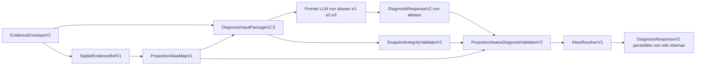

# Diagnosis V2.5-C: identidad de evidencia e integridad de proyección

**Estado:** plan técnico aprobado para implementación posterior

**Fecha:** 2026-07-19

**Alcance:** identidad estable de evidencia, aliases cortos por proyección, validación integral del snapshot y endurecimiento de los flujos activos de Diagnosis V2

**Dependencias:** Diagnosis V2.5-A y V2.5-B implementados en `main` mediante `aaf51198fffb261ecec752abb64b6fd343f82fef`

**Fuera de alcance:** implementación productiva de Diagnosis V3, capability gate de modelos y campaña dual V2/V3

---

## 1. Resumen ejecutivo

Diagnosis V2.5-A unificó los builders de entrada sobre una fábrica canónica. Diagnosis V2.5-B propagó la proyección real al validador y cerró el caso en el que un modelo podía citar evidencia oculta en `prompt_libre`.

El siguiente paso natural es Diagnosis V2.5-C. Esta fase debe resolver dos deudas relacionadas:

1. la identidad de evidencia todavía depende de referencias ordinales cortas cuya estabilidad entre corridas no está garantizada;
2. el validador recibe un snapshot, pero aún confía parcialmente en su contenido y conserva una ruta legacy donde el snapshot es opcional.

La solución propuesta separa tres conceptos:

```text
identidad interna estable
        ↓
alias corto visible dentro de una proyección
        ↓
resolución determinista y validación integral en AURA
```

El LLM verá aliases breves como `e1`, `e2` o `e3`. AURA conservará referencias internas estables y resolverá cada alias contra el issue y la evidencia exacta que fueron visibles en el snapshot. La salida persistente no dependerá del alias local.

---

## 2. Objetivos

### 2.1 Objetivo principal

Crear una capa de identidad y resolución de evidencia que reduzca costo de tokens, evite referencias cruzadas, mantenga trazabilidad entre corridas y permita validar de forma autónoma la integridad de cada `DiagnosisInputPackageV2`.

### 2.2 Objetivos específicos

- Definir una referencia interna estable y versionada para cada muestra de evidencia.
- Generar aliases cortos deterministas por proyección.
- Incluir el mapa de aliases dentro del snapshot hasheado.
- Resolver aliases del LLM hacia referencias internas antes del diagnóstico final.
- Rechazar aliases inexistentes, ocultos o pertenecientes a otro issue.
- Verificar `inputHash`, `promptHash`, `responseSchemaHash` e invariantes de proyección antes de validar la respuesta.
- Hacer obligatorio el snapshot en todos los flujos activos de producto y Laboratorio.
- Mantener una ruta legacy explícita únicamente para artefactos históricos o fixtures controlados.
- Medir el efecto real sobre tokens, latencia y cumplimiento contractual.

---

## 3. No objetivos

Esta fase no debe:

- activar Diagnosis V3 en producto;
- cambiar todavía la forma semántica de `DiagnosisResponseV2`;
- introducir un umbral por cantidad de parámetros del modelo;
- decidir qué modelos quedan aprobados;
- ejecutar una campaña dual V2/V3;
- modificar retrospectivamente receipts o campañas históricas;
- convertir el detector de claims en un juez semántico general;
- usar valores sensibles sin la transformación de privacidad correspondiente.

---

## 4. Problemas actuales

### 4.1 Referencias ordinales

Las referencias actuales del tipo:

```text
ev-0000
ev-0001
ev-0002
```

son compactas, pero pueden cambiar cuando varían:

- el orden global de issues;
- el orden de muestras;
- exclusiones por privacidad;
- límites de presupuesto;
- reglas de truncamiento;
- columnas excluidas;
- nuevas reglas insertadas antes de las existentes.

Esto dificulta comparar corridas, receipts y diagnósticos cuando la evidencia semántica es la misma pero el orden estructural cambia.

### 4.2 Snapshot parcialmente confiable

`validateDiagnosisResponseV2` puede recibir un `DiagnosisInputPackageV2`, pero el contexto de proyección se reconstruye principalmente desde `userPayload`. La implementación actual verifica contrato, versión, envelope ref, `inputMode` y JSON válido, pero no recalcula de manera integral todos los hashes e invariantes del snapshot antes de confiar en su proyección.

### 4.3 Snapshot opcional

La firma mantiene compatibilidad mediante:

```typescript
validateDiagnosisResponseV2(response, envelope, inputSnapshot?)
```

Los flujos activos revisados sí entregan el snapshot. Sin embargo, un caller nuevo podría omitirlo accidentalmente y recuperar el comportamiento legacy sin control de visibilidad.

### 4.4 Costo y dificultad para modelos pequeños

Una referencia estable larga es adecuada para persistencia, pero no necesariamente para ser copiada por el modelo. Pedir al LLM que reproduzca identificadores extensos aumenta tokens y superficie de error.

Por tanto, la identidad persistente y la referencia visible al modelo no deben ser el mismo objeto.

---

## 5. Principios de diseño

### 5.1 AURA es la autoridad de identidad

El LLM no inventa ni deriva identidades de evidencia. Solo puede citar aliases presentes en la proyección.

### 5.2 Los aliases son locales

Un alias como `e2` solo existe dentro de un `DiagnosisInputPackageV2` concreto. No debe persistirse como identidad histórica independiente.

### 5.3 La referencia interna es estable

La identidad interna debe sobrevivir a cambios no semánticos de orden, siempre que la representación visible de la evidencia y su contexto semántico permanezcan iguales.

### 5.4 Privacidad antes de identidad persistente

La referencia estable debe derivarse de la representación ya transformada por la política de privacidad, no del valor bruto cuando este no pueda conservarse.

### 5.5 Fallo cerrado

Cualquier inconsistencia entre envelope, snapshot, hashes, alias e issue debe bloquear la validación.

### 5.6 Compatibilidad explícita

La ruta legacy no debe permanecer como una omisión silenciosa. Debe nombrarse y aislarse.

---

## 6. Arquitectura propuesta



Responsabilidades:

```text
StableEvidenceRefV1
  produce identidad interna estable

ProjectionAliasMapV1
  asigna aliases cortos por snapshot

SnapshotIntegrityValidatorV2
  verifica hashes e invariantes antes de usar la proyección

ProjectionAwareDiagnosisValidatorV2
  valida que cada alias fue visible y pertenece al issue correcto

AliasResolverV1
  convierte aliases aceptados en referencias internas persistibles
```

---

## 7. Contratos propuestos

### 7.1 Referencia estable

Formato inicial:

```text
ev:v1:<issueDigest>:<sampleDigest>
```

Ejemplo:

```text
ev:v1:7baf91c2e10a:0d221a9f413c
```

Tipo:

```typescript
export type StableEvidenceRefV1 = string;
```

La validación debe exigir el patrón versionado correspondiente.

### 7.2 Material canónico de `issueDigest`

Propuesta:

```text
referenceAlgorithmVersion
+ issueId
+ ruleId
+ columnId
+ scope
```

### 7.3 Material canónico de `sampleDigest`

Propuesta:

```text
referenceAlgorithmVersion
+ issueDigest
+ canonicalPrivacyRepresentation
+ sampleSemanticPosition
```

`sampleSemanticPosition` no debe ser el índice global de la campaña. Debe ser una posición local y determinista dentro del issue después de aplicar selección, privacidad y orden canónico.

### 7.4 Entrada del mapa de aliases

```typescript
export interface EvidenceAliasEntryV1 {
  alias: string;
  stableEvidenceRef: StableEvidenceRefV1;
  issueId: string;
  columnId: string | null;
  sourceEvidenceRef?: string;
}
```

`sourceEvidenceRef` puede conservar temporalmente la ref ordinal V2 durante migración, pero no debe convertirse en la identidad de largo plazo.

### 7.5 Mapa de aliases

```typescript
export interface ProjectionAliasMapV1 {
  contractId: 'aura.evidence-alias-map.v1';
  contractVersion: '1.0.0';
  algorithmVersion: 'aura.evidence-alias.v1';
  entries: EvidenceAliasEntryV1[];
  aliasMapHash: string;
}
```

### 7.6 Extensión del snapshot

```typescript
export interface DiagnosisInputPackageV2_5 extends DiagnosisInputPackageV2 {
  stableReferenceAlgorithm: 'aura.evidence-ref.v1';
  evidenceAliases: ProjectionAliasMapV1;
  projectionHash: string;
}
```

La implementación puede introducir estos campos como opcionales durante una transición corta, pero los flujos activos de V2.5-C deben exigirlos.

---

## 8. Generación de aliases

### 8.1 Forma

Aliases iniciales:

```text
e1
e2
e3
...
```

No deben incluir información sensible ni codificar el issue directamente.

### 8.2 Orden determinista

Los aliases deben asignarse después de ordenar las entradas por una clave canónica, por ejemplo:

```text
issueId
→ columnId
→ stableEvidenceRef
```

La misma proyección debe producir el mismo mapa y el mismo `aliasMapHash`.

### 8.3 Alcance por proyección

- `prompt_libre`: mapa vacío.
- `smart_sample`: aliases para muestras visibles.
- `recommended`: aliases para muestras y anclas visibles, evitando duplicados.

### 8.4 Duplicados

Si la misma evidencia aparece en `evidenceSamples` y `badSampleAnchors`, debe compartir alias dentro del snapshot.

### 8.5 Límite

Definir un máximo explícito de aliases por snapshot. El límite debe alinearse con el presupuesto de evidencia y los máximos del schema de respuesta.

---

## 9. Representación visible para el LLM

El payload debe mostrar aliases, no refs internas largas:

```json
{
  "evidenceSamples": [
    {
      "evidenceRef": "e1",
      "issueId": "logic-negative-Ingresos",
      "columnId": "col:Ingresos:2",
      "values": [-500000]
    }
  ]
}
```

Los metadatos de tarea deben declarar:

```json
{
  "evidenceReferenceFormat": "projection_alias_v1",
  "allowedEvidenceAliasesByIssueId": {
    "logic-negative-Ingresos": ["e1"]
  }
}
```

No es necesario exponer al LLM el mapa completo `alias → stable ref`. Ese mapa pertenece al snapshot interno y a la auditoría.

---

## 10. Resolución de la respuesta

El modelo puede devolver:

```json
{
  "issueId": "logic-negative-Ingresos",
  "evidenceRefs": ["e1"]
}
```

Antes de persistir o ensamblar el resultado final, AURA debe resolver:

```text
e1
→ verificar visibilidad
→ verificar pertenencia al issue
→ obtener stableEvidenceRef
→ almacenar referencia interna
```

Resultado persistible:

```json
{
  "issueId": "logic-negative-Ingresos",
  "evidenceRefs": [
    "ev:v1:51a820cd7713:ad02c36d81fe"
  ]
}
```

Debe conservarse por separado evidencia de que el LLM citó `e1` dentro de ese snapshot, por ejemplo en receipt o trazabilidad:

```typescript
interface ResolvedEvidenceCitationV1 {
  issueId: string;
  alias: string;
  stableEvidenceRef: string;
}
```

---

## 11. Integridad del snapshot

### 11.1 Nueva función

```typescript
export function validateDiagnosisInputSnapshotIntegrityV2(
  snapshot: DiagnosisInputPackageV2_5,
  envelope: EvidenceEnvelopeV2,
): SnapshotIntegrityResultV2
```

### 11.2 Verificaciones mínimas

1. `contractId` y `contractVersion`.
2. `evidenceEnvelopeRef` recalculado.
3. `inputMode` permitido.
4. `userPayload` JSON válido.
5. coincidencia entre metadatos del snapshot y payload.
6. `includedSections` exactas para el modo.
7. `responseSchemaHash` recalculado.
8. `promptHash` recalculado usando la composición exacta.
9. `inputHash` recalculado.
10. `projectionHash` recalculado.
11. `aliasMapHash` recalculado.
12. aliases únicos.
13. stable refs únicas o duplicadas solo cuando representan la misma evidencia.
14. cada alias pertenece a un issue del envelope.
15. cada stable ref corresponde a una evidencia autorizada de ese issue.
16. ningún alias existe en `prompt_libre`.
17. ningún alias refiere evidencia eliminada por privacidad o truncamiento.
18. las refs visibles en payload coinciden exactamente con los aliases del mapa.

### 11.3 Resultado

```typescript
export interface SnapshotIntegrityResultV2 {
  valid: boolean;
  errors: SnapshotIntegrityErrorV2[];
}
```

Códigos sugeridos:

```text
DIAGNOSIS_INPUT_SNAPSHOT_INVALID
DIAGNOSIS_INPUT_HASH_MISMATCH
DIAGNOSIS_PROMPT_HASH_MISMATCH
DIAGNOSIS_SCHEMA_HASH_MISMATCH
DIAGNOSIS_PROJECTION_HASH_MISMATCH
DIAGNOSIS_ALIAS_MAP_HASH_MISMATCH
DIAGNOSIS_ALIAS_DUPLICATE
DIAGNOSIS_ALIAS_REFERENCE_INVALID
DIAGNOSIS_ALIAS_PROJECTION_MISMATCH
```

---

## 12. Endurecimiento de APIs

### 12.1 Ruta activa

Crear una firma que haga obligatorio el snapshot:

```typescript
export function validateProjectedDiagnosisResponseV2(
  response: DiagnosisResponseV2,
  envelope: EvidenceEnvelopeV2,
  inputSnapshot: DiagnosisInputPackageV2_5,
): ValidationResultV2
```

### 12.2 Ruta legacy

Mantener una función separada y explícita:

```typescript
export function validateDiagnosisResponseV2Legacy(
  response: DiagnosisResponseV2,
  envelope: EvidenceEnvelopeV2,
): ValidationResultV2
```

### 12.3 Compatibilidad temporal

La firma actual con parámetro opcional puede conservarse durante una sola etapa de transición, marcada como deprecated. Debe añadirse un test que impida nuevos usos productivos sin snapshot.

### 12.4 Call sites que deben migrarse

- selector de diagnóstico normal;
- pipeline principal;
- normalización HITL;
- revalidación efectiva;
- Laboratorio formal;
- evaluador contractual;
- fixtures de integración que representen ejecución real;
- exportes y receipts que revaliden respuestas.

Los harnesses históricos puramente deterministas pueden usar la ruta legacy de manera explícita.

---

## 13. Cambios en receipts y trazabilidad

Añadir campos versionados sin romper receipts históricos:

```typescript
interface EvidenceAliasReceiptV1 {
  algorithmVersion: 'aura.evidence-alias.v1';
  aliasMapHash: string;
  projectionHash: string;
  resolvedCitationsHash: string;
}
```

El receipt nuevo debe poder demostrar:

- qué snapshot se usó;
- qué aliases fueron visibles;
- cuáles citó el modelo;
- a qué stable refs se resolvieron;
- que el mapa no cambió entre prompt y validación.

Los receipts históricos V1 no deben reescribirse. El validador debe distinguir versiones.

---

## 14. Estrategia de migración

### Etapa C0: decisiones y contratos

- fijar formato de stable refs;
- fijar material canónico;
- decidir longitud inicial de digests;
- definir tratamiento de colisiones;
- definir tipos y errores;
- congelar ejemplos de referencia.

### Etapa C1: stable refs internas

- implementar generador;
- integrar después de privacidad;
- ordenar muestras canónicamente;
- conservar compatibilidad con refs ordinales;
- añadir fixtures Unicode, `null`, números y hashes de privacidad.

### Etapa C2: aliases por proyección

- construir mapa;
- asignar aliases deterministas;
- sustituir refs visibles en payload;
- incorporar `aliasMapHash` y `projectionHash`;
- probar los tres modos.

### Etapa C3: integridad del snapshot

- implementar validador dedicado;
- recalcular hashes;
- comparar proyección, mapa y payload;
- fallar cerrado ante alteraciones.

### Etapa C4: resolución de respuestas

- validar aliases por issue;
- resolver aliases a stable refs;
- preservar citas originales en trazabilidad;
- evitar persistencia de aliases como identidad final.

### Etapa C5: endurecimiento de APIs

- introducir ruta projected obligatoria;
- aislar legacy;
- migrar call sites activos;
- añadir lint/test arquitectónico de usos.

### Etapa C6: receipts y exportes

- añadir hashes versionados;
- adaptar export técnico;
- conservar lectura de receipts históricos;
- documentar compatibilidad.

### Etapa C7: medición comparativa V2.5-B contra V2.5-C

- ejecutar las mismas entradas;
- medir tokens de prompt y salida;
- medir latencia;
- contar errores de refs;
- verificar estabilidad de hashes;
- publicar baseline reproducible.

### Etapa C8: freeze

- typecheck;
- build;
- suite focalizada;
- suite completa;
- Graphify;
- documentación final;
- commit y SHA de cierre.

---

## 15. Matriz de pruebas

### 15.1 StableEvidenceRefV1

| Caso | Resultado esperado |
|---|---|
| Misma evidencia y política de privacidad | misma stable ref |
| Cambio de orden global | misma stable ref |
| Cambio de issue | ref diferente |
| Cambio de columna | ref diferente |
| Cambio de valor visible | ref diferente |
| Cambio de representación por privacidad | ref diferente y coherente |
| `null` | ref determinista |
| Unicode normalizado | ref determinista |
| Duplicado semántico | política documentada y estable |
| Colisión simulada | detectada y resuelta |

### 15.2 Alias map

| Caso | Resultado esperado |
|---|---|
| Misma proyección | mismo mapa |
| Cambio de orden de entrada no semántico | mismo mapa |
| `prompt_libre` | mapa vacío |
| Evidencia visible | alias asignado |
| Evidencia oculta | sin alias |
| Evidencia repetida como sample y anchor | un solo alias |
| Alias duplicado | error |
| Stable ref duplicada con distinto issue | error |

### 15.3 Snapshot integrity

| Caso | Resultado esperado |
|---|---|
| Snapshot intacto | válido |
| `inputHash` alterado | rechazado |
| `promptHash` alterado | rechazado |
| `responseSchemaHash` alterado | rechazado |
| `projectionHash` alterado | rechazado |
| `aliasMapHash` alterado | rechazado |
| Payload con alias extra | rechazado |
| Payload sin alias requerido | rechazado |
| Alias apunta a otro issue | rechazado |
| Snapshot pertenece a otro envelope | rechazado |
| Secciones incompatibles con modo | rechazado |

### 15.4 Respuesta del LLM

| Caso | Resultado esperado |
|---|---|
| Alias visible y correcto | aceptado y resuelto |
| Alias inexistente | rechazado |
| Alias de otro issue | rechazado |
| Alias oculto | rechazado |
| Stable ref larga inventada | rechazada si el contrato exige alias |
| Refs vacías en `prompt_libre` | aceptadas con HITL correspondiente |
| Alias repetido en un issue | deduplicación o rechazo según contrato fijado |

### 15.5 Compatibilidad

| Caso | Resultado esperado |
|---|---|
| Receipt histórico V1 | continúa validando con reglas históricas |
| Fixture legacy explícito | funciona por ruta legacy |
| Caller productivo sin snapshot | fallo de compilación o test arquitectónico |
| Export nuevo | incluye hashes de alias y resolución |

---

## 16. Métricas

La fase debe publicar comparación reproducible entre V2.5-B y V2.5-C:

| Métrica | Objetivo |
|---|---|
| Prompt tokens | reducción o no degradación significativa |
| Output tokens | reducción en refs copiadas |
| JSON parse success | no inferior |
| Schema compliance | no inferior |
| Reference failures | reducción |
| Alias resolution failures | 0 en fixtures válidos |
| Snapshot integrity detection | 100 % de mutaciones controladas |
| Latencia | no degradación significativa |
| Hash stability | 100 % en casos no semánticos |
| Colisiones no resueltas | 0 |

No debe declararse ahorro de tokens antes de medirlo con el tokenizer o métrica real de cada proveedor.

---

## 17. Criterios de aceptación

Diagnosis V2.5-C se considera completa cuando:

1. existe `StableEvidenceRefV1` versionado y probado;
2. cada modo produce el mapa de aliases esperado;
3. `prompt_libre` no expone aliases;
4. el snapshot incluye mapa y hashes verificables;
5. cualquier alteración del snapshot es detectada;
6. los flujos activos requieren snapshot;
7. aliases inexistentes, ocultos o cruzados se rechazan;
8. la respuesta persistente usa stable refs internas;
9. receipts nuevos registran la resolución sin romper históricos;
10. existe baseline reproducible V2.5-B contra V2.5-C;
11. typecheck y build pasan;
12. pruebas focalizadas pasan;
13. la suite completa no introduce regresiones nuevas;
14. Graphify refleja los nuevos contratos y dependencias;
15. la documentación marca claramente lo implementado y lo pendiente.

---

## 18. Gates de no avance

No se debe pasar al capability gate si ocurre cualquiera de estas condiciones:

- stable refs cambian por reordenamientos no semánticos;
- el alias map puede alterarse sin invalidar el snapshot;
- existe un flujo productivo que valida sin snapshot;
- el mismo alias puede resolver a dos evidencias distintas;
- la resolución pierde la asociación con el issue;
- se persisten aliases locales como identidad histórica;
- no existe medición reproducible de tokens y fallos;
- la compatibilidad con receipts históricos queda indefinida.

---

## 19. Riesgos y mitigaciones

### 19.1 Colisiones de digest

**Riesgo:** digests truncados pueden colisionar.

**Mitigación:** detección explícita durante construcción, ampliación automática o fallo cerrado. La longitud final debe fijarse con cálculo documentado, no por intuición.

### 19.2 Inestabilidad por canonicalización

**Riesgo:** objetos equivalentes producen refs diferentes.

**Mitigación:** usar serialización canónica, normalización Unicode y pruebas golden.

### 19.3 Exposición de PII mediante hashes

**Riesgo:** un hash estable de un valor bruto de baja entropía puede permitir ataques de diccionario.

**Mitigación:** derivar identidad desde la representación permitida por privacidad, revisar si se requiere salt contextual no secreto y nunca afirmar que hashing equivale automáticamente a anonimización.

### 19.4 Incremento de complejidad

**Riesgo:** mantener source refs, stable refs y aliases puede confundir.

**Mitigación:** nombres explícitos, contratos separados y una única función de resolución.

### 19.5 Compatibilidad con proveedores

**Riesgo:** algunos modelos pueden usar `e01`, `E1` o texto adicional.

**Mitigación:** contrato estricto, aliases sencillos, normalización solo si es inequívoca y pruebas con proveedores reales antes del gate.

### 19.6 Falsa sensación de validación semántica

**Riesgo:** refs correctas no garantizan interpretación correcta.

**Mitigación:** mantener separadas validación estructural, soporte literal y evaluación semántica.

---

## 20. Entregables

### Código

- generador `StableEvidenceRefV1`;
- constructor `ProjectionAliasMapV1`;
- extensión de `DiagnosisInputPackageV2`;
- `validateDiagnosisInputSnapshotIntegrityV2`;
- `validateProjectedDiagnosisResponseV2`;
- `validateDiagnosisResponseV2Legacy`;
- `AliasResolverV1`;
- actualización de receipts y exportes;
- migración de call sites activos.

### Pruebas

- unitarias de refs;
- unitarias de aliases;
- mutación de snapshots;
- integración de pipeline;
- Laboratorio formal;
- receipts históricos;
- adversariales;
- baseline reproducible.

### Evidencia

```text
docs/product/aura/evidence/diagnosis-v2.5-c/
  README.md
  v2.5-b-vs-v2.5-c-baseline.json
  snapshot-mutation-matrix.json
  stable-ref-golden-fixtures.json
```

### Documentación

- implementación final V2.5-C;
- decisiones de canonicalización;
- política de colisiones;
- compatibilidad de receipts;
- resultados de medición;
- pendientes para V2.5-D.

---

## 21. Próximo paso después de V2.5-C

Solo después del freeze de V2.5-C debe iniciarse Diagnosis V2.5-D:

```text
capability gate basado en comportamiento contractual
```

Ese gate debe probar el contrato real con aliases e integridad completa. No debe clasificar modelos por cantidad de parámetros, sino por resultados observables:

- JSON válido;
- cobertura exacta;
- aliases correctos;
- ausencia de refs cruzadas;
- respeto de HITL;
- ausencia de claims ocultos verificables;
- latencia y costo dentro de umbrales definidos.

---

## 22. Secuencia recomendada

```text
V2.5-C0  decisiones y contratos
V2.5-C1  stable refs
V2.5-C2  aliases por proyección
V2.5-C3  integridad del snapshot
V2.5-C4  resolución de respuestas
V2.5-C5  endurecimiento de APIs
V2.5-C6  receipts y exportes
V2.5-C7  baseline comparativo
V2.5-C8  freeze

→ V2.5-D capability gate
→ V3 aislado
→ campaña dual V2/V3
→ decisión de migración
```

---

## 23. Decisión recomendada

Aprobar Diagnosis V2.5-C como siguiente fase técnica, manteniendo V3 aislado.

La implementación debe comenzar por contratos y golden fixtures, no por modificar inmediatamente el payload productivo. Primero se fija la identidad; luego se conectan aliases, validación, resolución y receipts.

La frontera final debe ser inequívoca:

```text
AURA conserva la identidad estable.
El snapshot define qué aliases fueron visibles.
El LLM cita solo aliases locales.
AURA valida, resuelve y persiste referencias internas.
```
