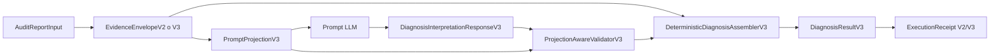
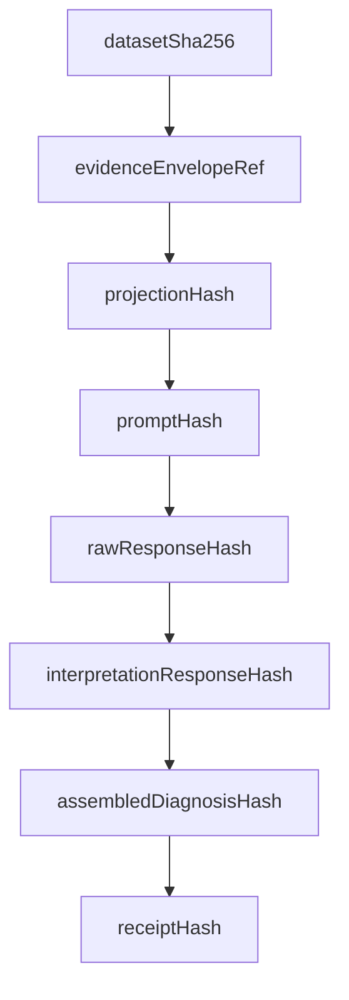

# AURA Diagnosis V3: contrato de interpretación pura

**Estado:** propuesta técnica y demo conceptual  
**Fecha:** 2026-07-19  
**Ámbito:** arquitectura de diagnóstico LLM  
**Repositorio:** `casabero-labs/aura`  
**Rama de diseño inicial:** `agent/unify-diagnosis-input-builders`  
**PR relacionado:** #51  
**Implementación productiva:** no implementada todavía  

---

## 1. Resumen ejecutivo

AURA V2 separa correctamente la detección determinista de problemas de calidad y la interpretación generada por un modelo de lenguaje. El motor de AURA produce un `EvidenceEnvelopeV2`, proyecta evidencia según uno de tres modos de entrada y exige al LLM una respuesta JSON validable.

Sin embargo, el contrato actual todavía obliga al modelo a copiar información que AURA ya conoce de forma determinista:

- `issueId`;
- `ruleId`;
- `columnId`;
- `scope`;
- `evidenceRefs`;
- correspondencias entre `issues[]` y `diagnosisBlocks[]`;
- parte de la política `requiresHumanReview`.

Esto transforma al LLM en cuatro cosas simultáneamente:

1. intérprete semántico;
2. copista de identidad;
3. motor de joins;
4. generador de JSON estricto.

La propuesta V3 reduce su responsabilidad al primer punto. El modelo devuelve solo interpretación semántica. AURA conserva y ensambla determinísticamente identidad, referencias, alcance, gobernanza y revisión humana.

La arquitectura propuesta introduce cinco piezas:

1. `PromptProjectionV3`;
2. `DiagnosisInterpretationResponseV3`;
3. `StableEvidenceRefV1`;
4. `DeterministicDiagnosisAssemblerV3`;
5. `ProjectionAwareValidatorV3`.

El objetivo no es debilitar el contrato. Es mover cada responsabilidad al componente más confiable para ejecutarla.

---

## 2. Estado de este documento

Este documento registra una propuesta de evolución y una simulación de comportamiento.

No afirma que V3 ya esté implementado. No reemplaza todavía:

- `DiagnosisResponseV2`;
- `validateDiagnosisResponseV2`;
- `buildDiagnosisInputPackageV2`;
- `ExecutionReceiptV1`;
- las campañas formales basadas en Contracts V2.

La propuesta debe pasar por:

- implementación aislada;
- pruebas contractuales;
- evaluación V2 contra V3;
- revisión de privacidad;
- compatibilidad con proveedores;
- aprobación de migración.

---

## 3. Problema que se desea resolver

### 3.1 Contrato actual simplificado

El modelo devuelve dos arreglos paralelos:

```json
{
  "issues": [
    {
      "issueId": "logic-negative-Ingresos",
      "evidenceRefs": ["ev-0001"],
      "hypothesis": "...",
      "confidence": 0.86,
      "requiresHumanReview": true,
      "limits": []
    }
  ],
  "diagnosisBlocks": [
    {
      "issueId": "logic-negative-Ingresos",
      "ruleId": "rule:impossible-negatives",
      "columnId": "col:Ingresos:2",
      "scope": "column",
      "observation": "...",
      "recommendation": "..."
    }
  ]
}
```

El LLM debe recordar que ambos objetos describen el mismo issue y copiar correctamente todos los campos de identidad.

### 3.2 Superficie de error

Los errores posibles incluyen:

- `issueId` inexistente;
- `issueId` repetido;
- issue omitido;
- bloque omitido;
- bloque huérfano;
- `ruleId` válido pero perteneciente a otro issue;
- `columnId` válido pero perteneciente a otro issue;
- `scope` incoherente;
- `evidenceRef` válido pero asociado al issue equivocado;
- downgrade indebido de `requiresHumanReview`;
- orden o cobertura divergente entre arreglos.

Estos errores no representan una mala interpretación de los datos. Representan fallos de copiado o de ensamblaje.

### 3.3 Ejemplo de fallo puramente estructural

Supóngase:

```text
issue-a → rule:extreme-outliers
issue-b → rule:impossible-negatives
```

El modelo interpreta correctamente `issue-a`, pero devuelve:

```json
{
  "issueId": "issue-a",
  "ruleId": "rule:impossible-negatives"
}
```

La interpretación puede ser semánticamente buena, pero la corrida completa debe rechazarse mediante `DIAGNOSIS_REFERENCE_INVALID`.

V3 busca impedir que ese error sea representable.

---

## 4. Principios de diseño

### 4.1 AURA conserva la identidad

AURA es la autoridad sobre:

- issues detectados;
- reglas activadas;
- columnas;
- alcance;
- evidencias seleccionadas;
- acción permitida;
- autorización automática;
- revisión humana mínima.

El LLM no debe recrear estos hechos.

### 4.2 El LLM interpreta, no autoriza

El modelo puede producir:

- hipótesis;
- observaciones;
- nivel de confianza;
- limitaciones;
- recomendaciones descriptivas.

No puede producir o modificar:

- decisiones de transformación;
- autorizaciones;
- identidad del issue;
- identidad de la regla;
- identidad de la columna;
- evidencia visible;
- política HITL mínima.

### 4.3 El validador conoce exactamente lo visible

El validador no debe comparar la respuesta solamente contra el envelope completo. Debe conocer la proyección exacta enviada al modelo.

Esto permite distinguir:

```text
evidencia existente en AURA
≠ evidencia visible para el LLM
```

### 4.4 Los contratos deben impedir errores, no solo detectarlos

Una buena arquitectura no añade validaciones infinitas alrededor de una forma propensa al error. Reduce la cantidad de estados inválidos que pueden construirse.

### 4.5 Compatibilidad antes que reemplazo brusco

V2 debe mantenerse durante la evaluación comparativa. V3 debe introducirse como contrato separado y versionado.

---

## 5. Arquitectura general propuesta



Responsabilidades:

```text
EvidenceEnvelope
  conoce el universo de evidencia y gobernanza

PromptProjectionV3
  registra qué fragmento de ese universo vio el modelo

DiagnosisInterpretationResponseV3
  contiene solo interpretación semántica

ProjectionAwareValidatorV3
  valida estructura, cobertura y soporte visible

DeterministicDiagnosisAssemblerV3
  une interpretación con identidad y gobernanza
```

---

## 6. Componente 1: PromptProjectionV3

### 6.1 Propósito

`PromptProjectionV3` es el registro explícito, congelado y hasheado de la evidencia visible para el LLM.

No reemplaza el envelope. Es una vista autorizada del envelope.

### 6.2 Responsabilidades

Debe registrar como mínimo:

- modo de entrada;
- issues requeridos;
- secciones incluidas;
- columnas visibles;
- referencias visibles por issue;
- disponibilidad de muestras;
- política aplicable cuando una evidencia está oculta;
- política HITL mínima;
- versión del algoritmo de referencias;
- hashes de la proyección y del prompt.

### 6.3 Tipo propuesto

```typescript
export interface PromptProjectionV3 {
  contractId: 'aura.prompt-projection.v3';
  contractVersion: '3.0.0';

  inputMode: DiagnosisInputModeV2;
  evidenceEnvelopeRef: string;

  requiredIssueIds: string[];
  includedSections: string[];

  visibleColumnIds: string[];
  visibleEvidenceRefsByIssueId: Record<string, string[]>;
  samplesVisibleByIssueId: Record<string, boolean>;

  issueIdsRequiringHumanReview: string[];
  issueIdsWithoutVisibleEvidence: string[];

  hiddenEvidencePolicy: {
    evidenceRefsMustBeEmpty: boolean;
    requiresHumanReviewMustBeTrue: boolean;
    limitationMustBeDeclared: boolean;
  };

  stableReferenceAlgorithm: 'aura.evidence-ref.v1';
  projectionHash: string;
  promptHash: string;
}
```

### 6.4 Invariantes

1. Cada `requiredIssueId` existe en el envelope.
2. Cada clave de `visibleEvidenceRefsByIssueId` pertenece a `requiredIssueIds`.
3. Cada ref visible existe en el envelope y pertenece al issue indicado.
4. Un issue sin muestras visibles aparece en `issueIdsWithoutVisibleEvidence`.
5. `prompt_libre` produce listas vacías de refs visibles.
6. `projectionHash` se calcula sobre una representación canónica sin el propio hash.
7. La proyección se congela profundamente antes de la ejecución.

### 6.5 Ejemplo `prompt_libre`

```json
{
  "contractId": "aura.prompt-projection.v3",
  "contractVersion": "3.0.0",
  "inputMode": "prompt_libre",
  "evidenceEnvelopeRef": "env:demo-creditos",
  "requiredIssueIds": [
    "logic-outlier-tukey-Edad",
    "logic-negative-Ingresos"
  ],
  "includedSections": [
    "dataset_summary",
    "dataset_schema",
    "issue_registry_minimal"
  ],
  "visibleColumnIds": [
    "col:Edad:1",
    "col:Ingresos:2"
  ],
  "visibleEvidenceRefsByIssueId": {
    "logic-outlier-tukey-Edad": [],
    "logic-negative-Ingresos": []
  },
  "samplesVisibleByIssueId": {
    "logic-outlier-tukey-Edad": false,
    "logic-negative-Ingresos": false
  },
  "issueIdsRequiringHumanReview": [
    "logic-outlier-tukey-Edad",
    "logic-negative-Ingresos"
  ],
  "issueIdsWithoutVisibleEvidence": [
    "logic-outlier-tukey-Edad",
    "logic-negative-Ingresos"
  ],
  "hiddenEvidencePolicy": {
    "evidenceRefsMustBeEmpty": true,
    "requiresHumanReviewMustBeTrue": true,
    "limitationMustBeDeclared": true
  },
  "stableReferenceAlgorithm": "aura.evidence-ref.v1",
  "projectionHash": "sha256:...",
  "promptHash": "sha256:..."
}
```

---

## 7. Componente 2: DiagnosisInterpretationResponseV3

### 7.1 Propósito

Es el único objeto que debe generar el LLM.

Contiene interpretación semántica indexada por `issueId`, sin repetir identidad secundaria.

### 7.2 Tipo propuesto

```typescript
export interface DiagnosisInterpretationV3 {
  hypothesis: string;
  confidence: number;
  limits: string[];
  observation: string;
  recommendation: string;
}

export interface DiagnosisInterpretationResponseV3 {
  contractId: 'aura.diagnosis-interpretation.v3';
  contractVersion: '3.0.0';
  evidenceEnvelopeRef: string;
  projectionHash: string;
  responseId: string;

  interpretations: Record<string, DiagnosisInterpretationV3>;
  globalLimitations: string[];
  generatedAt: string;
}
```

### 7.3 Campos deliberadamente ausentes

El LLM no devuelve:

```text
ruleId
columnId
scope
evidenceRefs
requiresHumanReview
actionability
automaticAuthorization
```

### 7.4 Ejemplo

```json
{
  "contractId": "aura.diagnosis-interpretation.v3",
  "contractVersion": "3.0.0",
  "evidenceEnvelopeRef": "env:demo-creditos",
  "projectionHash": "sha256:projection-demo",
  "responseId": "diag-v3-demo-001",
  "interpretations": {
    "logic-outlier-tukey-Edad": {
      "hypothesis": "El valor 240 puede corresponder a un error de captura o a una unidad incorrecta.",
      "confidence": 0.97,
      "limits": [
        "No se dispone de fecha de nacimiento para confirmar el valor."
      ],
      "observation": "La columna Edad contiene un valor extremo incompatible con el rango dominante.",
      "recommendation": "Verificar el registro contra la fuente original antes de corregirlo."
    },
    "logic-negative-Ingresos": {
      "hypothesis": "El valor negativo puede representar una reversión contable o un error de signo.",
      "confidence": 0.86,
      "limits": [
        "No se conoce si el dominio admite ajustes o devoluciones."
      ],
      "observation": "La columna Ingresos contiene un valor negativo en un conjunto predominantemente positivo.",
      "recommendation": "Confirmar la semántica financiera del campo antes de modificar el dato."
    }
  },
  "globalLimitations": [],
  "generatedAt": "2026-07-19T00:00:00.000Z"
}
```

### 7.5 Por qué usar un mapa por `issueId`

Un mapa elimina el join entre dos arreglos paralelos.

Permite validar cobertura con una operación directa:

```typescript
Object.keys(response.interpretations)
```

También permite construir el schema con propiedades exactas cuando el proveedor soporte schemas suficientemente grandes:

```json
{
  "properties": {
    "interpretations": {
      "type": "object",
      "required": ["issue-a", "issue-b"],
      "additionalProperties": false
    }
  }
}
```

Para envelopes con muchos issues, puede evaluarse una variante de arreglo único:

```json
{
  "interpretations": [
    {
      "issueId": "issue-a",
      "hypothesis": "..."
    }
  ]
}
```

La opción de mapa es preferida mientras no exista evidencia de incompatibilidad relevante entre proveedores.

---

## 8. Componente 3: StableEvidenceRefV1

### 8.1 Problema actual

Las referencias ordinales como:

```text
ev-0000
ev-0001
ev-0002
```

cambian cuando cambia el orden de:

- issues;
- muestras;
- exclusiones;
- presupuesto;
- política de privacidad.

Esto dificulta la comparación entre corridas.

### 8.2 Formato propuesto

```text
ev:v1:<issueDigest>:<sampleDigest>
```

Ejemplo:

```text
ev:v1:7baf91c2e10a:0d221a9f413c
```

### 8.3 Material canónico sugerido

`issueDigest`:

```text
contractVersion
+ issueId
+ ruleId
+ columnId
+ scope
```

`sampleDigest`:

```text
referenceAlgorithmVersion
+ issueDigest
+ privacyRepresentation
+ sampleLocalOrdinal
```

### 8.4 Regla de privacidad

El hash de la muestra debe calcularse sobre la representación ya transformada por privacidad:

```text
valor bruto
→ redacción o hashing de privacidad
→ representación visible
→ stable evidence ref
```

No debe usarse el valor bruto como material persistente cuando la política no permite conservarlo.

### 8.5 Longitud

La longitud debe medirse contra riesgo de colisión y costo de tokens.

Propuesta inicial:

- 12 caracteres hexadecimales para `issueDigest`;
- 12 caracteres hexadecimales para `sampleDigest`;
- detección explícita de colisiones durante construcción;
- ampliación automática a 16 caracteres cuando ocurra una colisión.

No se debe asumir que un hash corto es infalible.

---

## 9. Componente 4: ProjectionAwareValidatorV3

### 9.1 Firma propuesta

```typescript
export function validateDiagnosisInterpretationV3(
  response: DiagnosisInterpretationResponseV3,
  envelope: EvidenceEnvelopeV2,
  projection: PromptProjectionV3,
): ValidationResultV3
```

### 9.2 Orden de validación

1. Validar schema JSON.
2. Verificar `contractId` y versión.
3. Verificar `evidenceEnvelopeRef`.
4. Verificar `projectionHash`.
5. Verificar cobertura exacta de `requiredIssueIds`.
6. Rechazar claves adicionales.
7. Validar límites de longitud.
8. Validar `confidence`.
9. Detectar código o contenido ejecutable.
10. Detectar claims no soportados por evidencia visible.
11. Exigir limitación cuando no hubo evidencia visible.
12. Emitir warnings y errores con códigos estables.

### 9.3 Códigos propuestos

```text
DIAGNOSIS_V3_SCHEMA_INVALID
DIAGNOSIS_V3_ENVELOPE_MISMATCH
DIAGNOSIS_V3_PROJECTION_MISMATCH
DIAGNOSIS_V3_COVERAGE_MISSING
DIAGNOSIS_V3_COVERAGE_EXTRA
DIAGNOSIS_V3_CONFIDENCE_INVALID
DIAGNOSIS_V3_EXECUTABLE_CONTENT
DIAGNOSIS_V3_UNSUPPORTED_CLAIM
DIAGNOSIS_V3_HIDDEN_EVIDENCE_CLAIM
DIAGNOSIS_V3_REQUIRED_LIMITATION_MISSING
```

### 9.4 Error que desaparece del contrato LLM

El modelo ya no puede producir directamente:

```text
DIAGNOSIS_REFERENCE_INVALID por ruleId
DIAGNOSIS_REFERENCE_INVALID por columnId
DIAGNOSIS_REFERENCE_INVALID por scope
DIAGNOSIS_REFERENCE_INVALID por evidenceRef cruzada
```

Estos datos no forman parte de su respuesta.

Todavía pueden existir errores internos de AURA durante el ensamblaje. Esos errores deben clasificarse como fallos deterministas del sistema, no como fallos del LLM.

---

## 10. Componente 5: DeterministicDiagnosisAssemblerV3

### 10.1 Propósito

Construye el diagnóstico final utilizando:

- identidad del envelope;
- visibilidad de la proyección;
- interpretación validada del modelo;
- política HITL determinista.

### 10.2 Firma propuesta

```typescript
export function assembleDiagnosisResultV3(
  envelope: EvidenceEnvelopeV2,
  projection: PromptProjectionV3,
  interpretation: DiagnosisInterpretationResponseV3,
): DiagnosisResultV3
```

### 10.3 Tipo final propuesto

```typescript
export interface AssembledDiagnosisV3 {
  issueId: string;
  ruleId: string;
  columnId: string | null;
  scope: 'dataset' | 'column';

  evidenceRefs: string[];
  requiresHumanReview: boolean;
  actionability: 'auto_safe' | 'review_only' | 'not_actionable';

  hypothesis: string;
  confidence: number;
  limits: string[];
  observation: string;
  recommendation: string;
}

export interface DiagnosisResultV3 {
  contractId: 'aura.diagnosis.v3';
  contractVersion: '3.0.0';
  evidenceEnvelopeRef: string;
  projectionHash: string;
  interpretationResponseHash: string;
  diagnoses: AssembledDiagnosisV3[];
  globalLimitations: string[];
  generatedAt: string;
}
```

### 10.4 Algoritmo

```typescript
for (const issueId of projection.requiredIssueIds) {
  const issue = envelopeIssueMap.get(issueId);
  const semantic = interpretation.interpretations[issueId];

  diagnoses.push({
    issueId: issue.issueId,
    ruleId: issue.ruleId,
    columnId: issue.columnId,
    scope: issue.scope,
    evidenceRefs: projection.visibleEvidenceRefsByIssueId[issueId],
    requiresHumanReview: deterministicReviewPolicy(issue, projection),
    actionability: issue.actionability,
    ...semantic,
  });
}
```

### 10.5 Invariantes

- El ensamblador no acepta una interpretación no validada.
- No lee IDs secundarios desde el LLM.
- No añade evidence refs ocultas como si hubieran sustentado la interpretación.
- Si `prompt_libre` ocultó muestras, el diagnóstico final conserva `evidenceRefs: []` para la interpretación LLM.
- Las evidencias internas del engine pueden conservarse en otra sección de auditoría, claramente separadas de las citas visibles al modelo.

---

## 11. Demo con dataset ficticio

### 11.1 Dataset

`clientes_credito.csv`:

| ClienteId | Edad | Ingresos | Ciudad | TipoVivienda |
|---|---:|---:|---|---|
| C-001 | 34 | 3.200.000 | Montería | Propia |
| C-002 | 240 | 2.800.000 | Cereté | Arrendada |
| C-003 | 41 | -500.000 | Montería | Propia |
| C-004 | 29 | 4.100.000 | Lorica | PROPIA |

Hallazgos:

1. Edad extrema: `240`.
2. Ingreso negativo: `-500.000`.
3. Variante semántica: `Propia` y `PROPIA`.

### 11.2 Identidad determinista

```json
[
  {
    "issueId": "logic-outlier-tukey-Edad",
    "ruleId": "rule:extreme-outliers",
    "columnId": "col:Edad:1",
    "scope": "column"
  },
  {
    "issueId": "logic-negative-Ingresos",
    "ruleId": "rule:impossible-negatives",
    "columnId": "col:Ingresos:2",
    "scope": "column"
  },
  {
    "issueId": "semantic-variants-TipoVivienda",
    "ruleId": "rule:semantic-variants",
    "columnId": "col:TipoVivienda:4",
    "scope": "column"
  }
]
```

### 11.3 Corrida V2 válida

El LLM debe copiar correctamente 18 campos estructurales aproximados para tres issues, además del contenido semántico.

### 11.4 Corrida V2 con join incorrecto

```json
{
  "issueId": "logic-outlier-tukey-Edad",
  "ruleId": "rule:impossible-negatives"
}
```

Resultado:

```text
DIAGNOSIS_REFERENCE_INVALID
```

La interpretación puede ser correcta, pero la respuesta queda bloqueada.

### 11.5 Corrida V3

El LLM devuelve:

```json
{
  "interpretations": {
    "logic-outlier-tukey-Edad": {
      "hypothesis": "El valor 240 puede corresponder a un error de captura.",
      "confidence": 0.97,
      "limits": [],
      "observation": "Edad contiene un valor extremo.",
      "recommendation": "Verificar el registro contra la fuente."
    }
  }
}
```

AURA añade:

```json
{
  "issueId": "logic-outlier-tukey-Edad",
  "ruleId": "rule:extreme-outliers",
  "columnId": "col:Edad:1",
  "scope": "column",
  "evidenceRefs": ["ev:v1:7baf91c2e10a:0d221a9f413c"],
  "requiresHumanReview": true
}
```

El join incorrecto no puede ser expresado por el modelo.

---

## 12. Comportamiento por modo de entrada

### 12.1 `prompt_libre`

Proyección:

- resumen del dataset;
- esquema de columnas;
- registro mínimo de issues;
- sin estadísticas detalladas;
- sin muestras;
- sin refs visibles.

Reglas V3:

- `visibleEvidenceRefsByIssueId[issueId] = []`;
- el LLM no devuelve refs;
- AURA exige limitaciones explícitas;
- revisión humana mínima verdadera;
- recomendaciones cautas.

### 12.2 `smart_sample`

Proyección:

- resumen;
- esquema;
- issues mínimos;
- estadísticas;
- activaciones de reglas;
- muestras transformadas por privacidad.

Reglas V3:

- solo las muestras visibles pueden apoyar claims;
- el ensamblador conserva las refs visibles;
- la política HITL sigue siendo determinista.

### 12.3 `recommended`

Proyección:

- todo lo anterior;
- registro completo de columnas;
- actionability;
- autorización;
- manifiestos de selección y truncamiento;
- anclas de muestras.

Reglas V3:

- el LLM puede explicar mejor límites de gobernanza;
- no puede cambiar autorización ni actionability;
- el validador puede exigir que las limitaciones reflejen truncamientos relevantes.

---

## 13. Privacidad y seguridad

### 13.1 Separación necesaria

El modo de entrada no sustituye la política de privacidad.

```text
privacyPolicy
  decide cómo se transforma la evidencia

inputMode
  decide qué secciones transformadas se proyectan
```

### 13.2 Claims sobre evidencia oculta

El validador V3 debe rechazar una observación que afirme haber visto valores no presentes en la proyección.

Ejemplo en `prompt_libre`:

```text
"Se observó exactamente el valor -500000"
```

Si la muestra no fue visible, debe emitirse:

```text
DIAGNOSIS_V3_HIDDEN_EVIDENCE_CLAIM
```

### 13.3 Prompt injection

Los nombres de columnas, muestras, descripciones y valores siguen siendo contenido no confiable.

La instrucción del sistema debe mantener:

- prohibición de ejecutar instrucciones del dataset;
- prohibición de código;
- salida JSON única;
- claims limitados a evidencia visible;
- recomendaciones descriptivas.

### 13.4 Hashes

Los hashes aportan integridad y reproducibilidad. No equivalen a una firma digital ni prueban la identidad del emisor.

---

## 14. Execution Receipt futuro

V3 debería conservar la trazabilidad actual y añadir:

```text
projectionHash
interpretationResponseHash
assembledDiagnosisHash
stableReferenceAlgorithmVersion
validatorVersion
assemblerVersion
```

Flujo de hashes:



---

## 15. Estrategia de compatibilidad

### 15.1 No reemplazar V2 de inmediato

Durante la evaluación deben coexistir:

```text
aura.diagnosis.v2
aura.diagnosis-interpretation.v3
aura.diagnosis.v3
```

### 15.2 Adaptador V3 a representación de lectura existente

La UI puede consumir inicialmente un adaptador:

```typescript
DiagnosisResultV3 -> DiagnosisResponseV2ViewModel
```

Este adaptador es para presentación, no para volver a validar como si la salida hubiera sido producida por el LLM.

### 15.3 Feature flag

Propuesta:

```text
AURA_DIAGNOSIS_CONTRACT=v2|v3|dual
```

- `v2`: comportamiento actual;
- `v3`: interpretación pura;
- `dual`: ejecuta ambos para comparación controlada.

---

## 16. Campaña comparativa V2 contra V3

### 16.1 Hipótesis

V3 reducirá fallos estructurales y tokens de salida sin degradar la calidad semántica.

Debe tratarse como hipótesis, no como resultado demostrado.

### 16.2 Métricas

| Métrica | V2 | V3 | Objetivo |
|---|---:|---:|---|
| JSON parse success | medir | medir | V3 ≥ V2 |
| schema valid | medir | medir | V3 > V2 |
| exact coverage | medir | medir | V3 > V2 |
| reference failures | medir | N/A LLM | eliminar clase |
| tokens de salida | medir | medir | reducción |
| latencia | medir | medir | no degradar significativamente |
| reintentos | medir | medir | reducción |
| calidad semántica | medir | medir | no inferioridad |
| claims no soportados | medir | medir | V3 ≤ V2 |
| acuerdo HITL | medir | determinista | 100 % |

### 16.3 Modelos

Probar al menos:

- modelo local pequeño;
- modelo local mediano;
- proveedor cloud;
- proveedor con structured output;
- proveedor sin structured output estricto.

### 16.4 Datasets

Incluir:

- dataset pequeño con 1–3 issues;
- dataset con más de 10 issues;
- columnas duplicadas;
- PII;
- muestras ocultas;
- truncamiento por presupuesto;
- issues sin evidencia;
- contenido adversarial;
- nombres Unicode;
- dataset sin issues.

---

## 17. Plan de implementación

### Fase V3-L0: contratos

- definir tipos;
- definir schemas;
- fijar invariantes;
- documentar versionado.

### Fase V3-L1: proyección

- construir `PromptProjectionV3`;
- congelamiento;
- hash;
- pruebas por modo.

### Fase V3-L2: referencias estables

- implementar algoritmo;
- detectar colisiones;
- migrar fixtures nuevos;
- mantener refs ordinales en V2.

### Fase V3-L3: prompt y parser

- construir prompt de interpretación pura;
- parser estricto;
- pruebas adversariales.

### Fase V3-L4: validador

- validar contra proyección;
- claims visibles;
- cobertura;
- limitaciones obligatorias.

### Fase V3-L5: ensamblador

- merge determinista;
- HITL;
- actionability;
- hashes del resultado.

### Fase V3-L6: dual run

- ejecutar V2 y V3 sobre los mismos envelopes;
- registrar métricas;
- comparar calidad.

### Fase V3-L7: integración

- adaptar UI y PDF;
- receipts;
- observabilidad;
- feature flag.

### Fase V3-L8: decisión

- informe comparativo;
- criterios de no inferioridad;
- decisión de migración;
- deprecación gradual de V2.

---

## 18. Pruebas mínimas

### 18.1 PromptProjectionV3

- secciones exactas por modo;
- refs visibles correctas;
- refs ocultas vacías;
- hash estable;
- deep freeze;
- mismatch con envelope rechazado.

### 18.2 StableEvidenceRefV1

- misma entrada produce misma ref;
- cambio de privacidad cambia ref cuando cambia la representación;
- cambio de orden global no cambia ref;
- colisión detectada;
- Unicode estable;
- null estable.

### 18.3 Response V3

- cobertura completa;
- clave adicional rechazada;
- clave faltante rechazada;
- confidence fuera de rango;
- código ejecutable;
- texto demasiado largo;
- timestamp inválido.

### 18.4 Validador consciente de proyección

- claim de muestra oculta rechazado;
- claim visible aceptado;
- limitación requerida ausente;
- `projectionHash` incorrecto;
- `evidenceEnvelopeRef` incorrecto.

### 18.5 Ensamblador

- identidad tomada del envelope;
- refs tomadas de la proyección;
- HITL no degradable;
- salida determinista;
- hash estable;
- imposible inyectar ruleId desde la respuesta.

---

## 19. Criterios de aceptación del demo técnico

El demo se considera completo cuando:

1. se pueden construir proyecciones de los tres modos;
2. el modelo o fixture devuelve interpretación pura;
3. el validador usa envelope y proyección;
4. AURA ensambla identidad sin leerla del LLM;
5. una asociación cruzada de ruleId no puede expresarse;
6. una evidencia oculta no puede citarse;
7. refs estables sobreviven a cambios de orden no semánticos;
8. existe una corrida dual V2/V3 reproducible;
9. se registran métricas comparables;
10. no se declara superioridad sin evidencia experimental.

---

## 20. Decisiones abiertas

### 20.1 Nombre de versión

Evaluar:

```text
PromptProjectionV2 + Diagnosis V3
```

frente a:

```text
PromptProjectionV3 + Diagnosis V3
```

Se recomienda mantener todo el nuevo conjunto en V3 para evitar una mezcla mental de contratos.

### 20.2 Mapa o arreglo único

Preferencia inicial: mapa por `issueId`.

Debe verificarse compatibilidad con providers y límites de JSON Schema.

### 20.3 Evidence refs en diagnóstico final

Definir si `evidenceRefs` representa:

- evidencia visible al LLM;
- evidencia total interna del engine;
- ambas en campos separados.

Recomendación:

```typescript
visibleEvidenceRefs: string[];
engineEvidenceRefs: string[];
```

Esto evita atribuir al modelo evidencia que nunca vio.

### 20.4 Visualizaciones

Las recomendaciones de visualización también podrían salir del contrato LLM y calcularse determinísticamente según perfiles y severidades.

Debe evaluarse por separado.

### 20.5 `requiresHumanReview`

Debe ser 100 % determinista en el resultado final. El modelo puede expresar incertidumbre mediante `confidence` y `limits`, pero no reducir la política HITL.

---

## 21. Decisión recomendada

Adoptar la propuesta como experimento V3 aislado, manteniendo V2 como baseline.

Orden recomendado:

```text
contrato
→ proyección
→ refs estables
→ parser
→ validador
→ ensamblador
→ campaña dual
→ integración
```

No comenzar por modificar el validador V2 ni relajar sus reglas. V2 debe seguir siendo un baseline rígido y reproducible.

---

## 22. Conclusión

La evolución propuesta no busca que el LLM haga menos trabajo útil. Busca impedir que desperdicie capacidad en tareas deterministas.

La frontera de responsabilidad queda así:

```text
AURA decide qué existe, qué fue visible y qué requiere revisión.
El LLM explica qué podría significar.
AURA valida y ensambla el resultado final.
```

Este diseño reduce la superficie de error estructural, mejora la auditabilidad y permite evaluar la calidad semántica del modelo sin confundirla con su habilidad para copiar identificadores entre arreglos.
