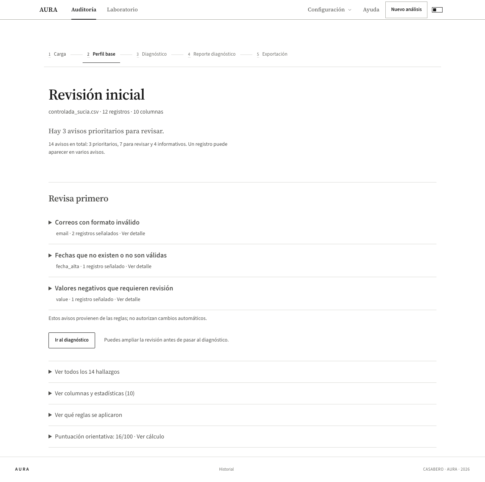

# Perfil base: resumen primero, detalles al pedirlos

5 de octubre de 2026. Verificación del código local; no certifica el despliegue público.

## Problema corregido

El perfil mostraba puntuación, reglas, barras, ranking de columnas, todos los hallazgos y una tabla de columnas antes de ofrecer el siguiente paso. Repetía información y daba más importancia al número de avisos que a su gravedad. Algunas frases, como «el dataset es usable», afirmaban una aptitud que las reglas no pueden certificar.

## Recorrido nuevo

Al entrar, la pantalla vuelve al inicio y presenta **Revisión inicial**, el nombre del archivo, sus registros y columnas, y una frase con el resultado. Explica que varios avisos pueden referirse al mismo registro.

Si hay avisos prioritarios, muestra hasta tres de ese nivel. Si solo hay advertencias, muestra hasta tres de ellas. Cuando el resumen es parcial, informa cuántos avisos de ese nivel faltan por mostrar. Un resumen sin avisos prioritarios sigue ofreciendo los hallazgos informativos, si existen.

Cada aviso se abre para ver su explicación, los números de registro y las muestras de valores originales. No autoriza correcciones automáticas. El botón **Ir al diagnóstico** aparece antes del informe completo.

Los detalles tienen accesos separados:

- **Ver todos los hallazgos**: lista completa, ordenada por importancia. Cada fila permite abrir sus registros y valores.
- **Ver columnas y estadísticas**: selector de una columna, con sus estadísticas y muestras. No repite toda la lista de columnas en varias secciones.
- **Ver las reglas aplicadas**: condiciones elegidas antes de analizar, incluidas las excepciones.
- **Puntuación orientativa**: cálculo completo y explicación de que no es un porcentaje de datos correctos ni una medida de precisión.

Se retiraron del inicio las barras de gravedad, el ranking de columnas por cantidad de avisos y las tablas completas. Las clasificaciones visibles son **Prioritario**, **Para revisar** e **Informativo**. La clasificación original del motor permanece intacta.

## Evidencia

[Resumen en móvil](screenshots/perfil-resumen-mobile.png)

El CSV controlado conserva 14 hallazgos, tres críticos en el motor y 16/100. El cambio de presentación no altera los hallazgos, las reglas ni el cálculo. El CSV limpio conserva cero hallazgos y 100/100. La referencia real guardada de Nano mantiene la misma evidencia y sus nueve hallazgos de Titanic.

## Comprobaciones

- 167 archivos de pruebas: 2.243 pruebas aprobadas y seis omitidas. Incluye puntuación y todas las protecciones del pipeline.
- Compilación aprobada.
- 25 pruebas de navegador aprobadas: carga, condiciones elegidas, perfil, diagnóstico, exportación, archivos vacíos, claro/oscuro y escritorio/móvil.
- Apertura de un aviso con teclado, acceso a los 14 hallazgos, muestras con ceros originales y cambio de columna sin acumular paneles.
- Sin errores de página ni desplazamiento horizontal del documento en el recorrido controlado, incluidos los detalles numéricos en móvil.
- Detector visual sin observaciones en los componentes revisados. Se actualizó el grafo de navegación.

Las pruebas que dependen de proveedores externos no se ejecutaron como parte de esta revisión de presentación.
