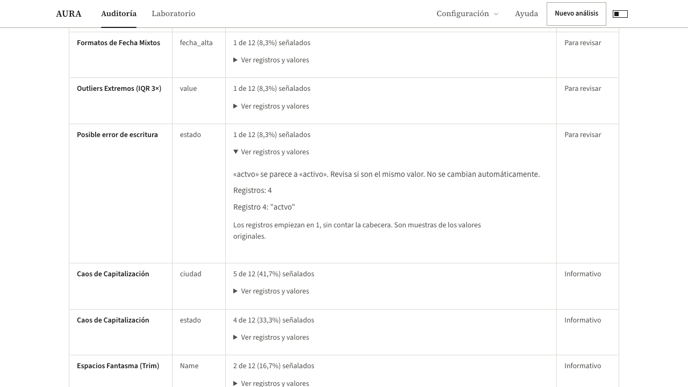

# Primera etapa: posibles errores de escritura y evidencia visible

Comprobación local del 5 de octubre de 2026. Estos cambios todavía no están publicados.

## Qué se corrigió

AURA ahora avisa cuando una palabra poco frecuente se parece mucho a otra categoría repetida. En el archivo controlado, `actvo`, registro 4, se compara con `activo`. Es una petición de revisión: no cambia el dato ni afirma que ambas palabras signifiquen lo mismo.

La detección se limita a palabras cortas, una letra de diferencia o dos letras vecinas intercambiadas, con una alternativa claramente más frecuente. Omite nombres de personas, identificadores, códigos y texto libre. También evita proponer una alternativa si hay varias igualmente posibles. Cuando existe una lista declarada de valores permitidos, usa esa regla.

La tabla de hallazgos ahora muestra números de registro y valores originales. Conserva los ceros de los documentos, señala los vacíos y permite distinguir espacios de texto. Cada hallazgo guarda hasta 20 referencias de registros y muestra hasta tres valores originales; estas muestras no son la lista completa de afectados. Los números empiezan en 1 y excluyen la cabecera.

Se añadieron referencias a varias reglas anteriores. En el archivo controlado, los 14 hallazgos tienen registros y valores originales. Esto no significa que todas las reglas del motor tengan evidencia completa: algunos avisos describen la columna o su distribución.

## Resultado con CSV solamente

No se cargó ningún JSON de reglas.

| Archivo | Antes | Después |
|---|---|---|
| [Control con errores](fixtures/controlada_sucia.csv) | 13 hallazgos, 3 críticos, 19/100 | 14 hallazgos, 3 críticos, 16/100 |
| [Control limpio](fixtures/controlada_limpia.csv) | Sin hallazgos, 100/100 | Sin hallazgos, 100/100 |

El hallazgo adicional es `actvo`. Se clasifica como advertencia, no como crítico. El puntaje baja porque incorpora ese aviso; no representa una medida de precisión del detector. Los datos originales permanecen iguales.

## Comprobaciones

- `npm run verify`: 167 archivos de pruebas aprobados, 2.237 pruebas aprobadas y seis omitidas. Incluye las pruebas de puntuación y las protecciones del pipeline.
- `npm run build`: aprobado.
- `npm run test:e2e -- tests/e2e/rule-engine.spec.ts`: tres pruebas aprobadas. Incluyen carga real del CSV, evidencia visible, revisión móvil y control limpio.
- Titanic conserva nueve hallazgos y exactamente la misma huella de evidencia de la captura real guardada de Gemini Nano. La nueva prueba compara la evidencia calculada desde el CSV con esa captura. No se modificaron las respuestas guardadas ni fue necesaria otra captura de Nano.
- `git diff --check`: aprobado. Se actualizó el grafo de navegación del código.

## Siguiente etapa

Crear preguntas sencillas en la aplicación para indicar valores permitidos, límites y condiciones del archivo, sin pedir un JSON. Esa pantalla todavía no está implementada en esta etapa.

Actualización posterior: este recorrido se completó y probó en la [segunda etapa](reglas-y-excepciones.md).
