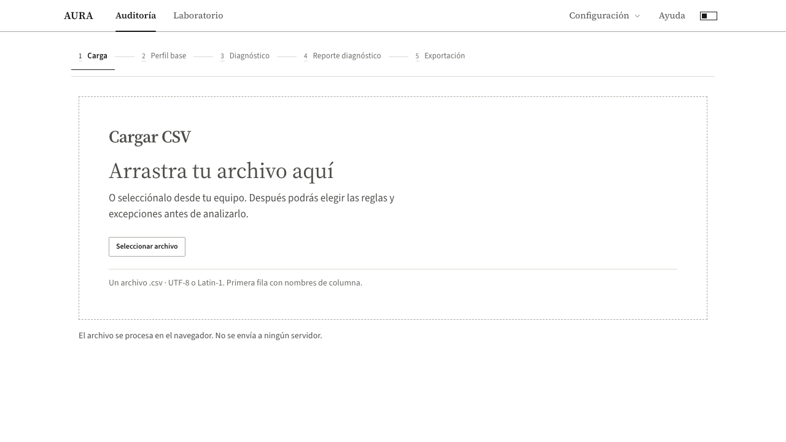

# Reglas y excepciones antes del análisis

Comprobación local del 5 de octubre de 2026. Cambios preparados y probados; todavía no publicados.

## Recorrido

1. Cargar o arrastrar un CSV. AURA lee hasta cinco registros para mostrar columnas y ejemplos; todavía no ejecuta la auditoría.
2. Abrir las columnas que necesitan condiciones propias. Elegir si se permiten vacíos, repetidos o números negativos; indicar valores permitidos, tipo de dato, formato de fecha, límites, enteros o cantidad de caracteres.
3. Pulsar **Analizar dataset**. AURA lee el archivo completo y aplica esas decisiones.
4. Revisar **Reglas y excepciones aplicadas** en el resultado.

Dejar los controles en su opción general conserva el comportamiento anterior. No se crean reglas de negocio a partir de las muestras. Las opciones avanzadas mantienen la importación de un JSON, pero ya no es necesaria para este recorrido.

Se puede restablecer una columna o cambiar el archivo. Cambiarlo retira las condiciones del archivo anterior. Los límites contradictorios y las reglas importadas que mencionan columnas inexistentes impiden iniciar el análisis y muestran el motivo.

## Qué significa una excepción

- Permitir repetidos retira la exigencia de unicidad de esa columna. No desactiva la revisión de registros completos idénticos.
- Permitir vacíos retira el hallazgo de valores faltantes, pero conserva su conteo en las estadísticas. Los marcadores escritos, como `null`, pueden conservar su aviso específico.
- Permitir negativos retira la prohibición general de negativos. Conserva los límites declarados y los avisos estadísticos de valores extremos.
- La lista de valores permitidos distingue mayúsculas y acentos. Es una condición declarada por la persona, no un catálogo inventado por AURA.

Las decisiones y los datos originales se conservan por separado. La revisión de una copia utiliza las mismas condiciones del análisis original.

## Diseño y carga

Casabero Editorial: fondo blanco o negro según el modo, títulos serif, controles sans, filetes y botones sin rellenos decorativos. La zona de carga explica el siguiente paso, permite seleccionar con teclado y muestra errores concretos. Solo acepta un archivo CSV por revisión.

[Condiciones en escritorio](screenshots/reglas-editorial.png) · [Condiciones en móvil](screenshots/reglas-editorial-mobile.png)

## Comprobaciones

- `npm run verify`: 167 archivos aprobados; 2.240 pruebas aprobadas y seis omitidas. Incluye puntuación, protecciones del pipeline y la referencia real guardada de Nano.
- `npm run build`: aprobado.
- 24 pruebas distintas de navegador aprobadas entre las suites `rule-engine`, `editorial-loop01`, `editorial-loop02`, `editorial-loop02-u06`, `editorial-no-fills` y `ux-p1-wave0`. Cubren CSV con errores, control limpio, condiciones elegidas en pantalla, importación opcional, reintento con un CSV vacío, navegación y exportación, modo claro/oscuro y tamaños de 1280 y 390 píxeles.
- En el control sucio se permitió repetir `documento`, dejarlo vacío y usar negativos en `value`; se declaró la lista válida para `estado`. Desaparecieron los avisos exceptuados. La fecha imposible y el estado no permitido siguieron detectándose.
- El control limpio, sin condiciones propias, conserva cero hallazgos y 100/100.
- Se adaptaron las pruebas de recorrido existentes al nuevo botón de inicio. No se ejecutaron todas las suites de proveedores externos.

Los CSV y las respuestas guardadas de Nano no se modificaron. No se certifica un despliegue público con estas pruebas locales.
